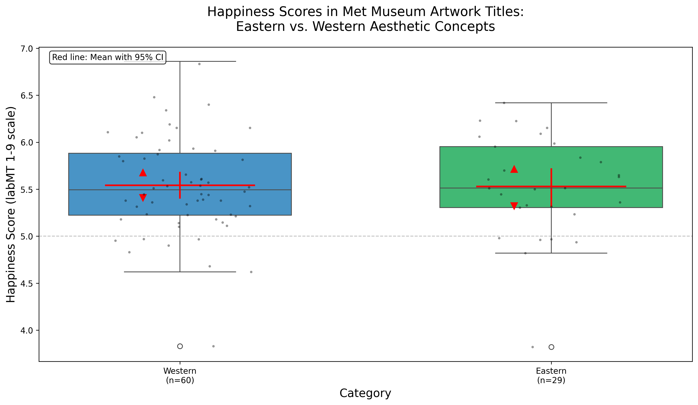
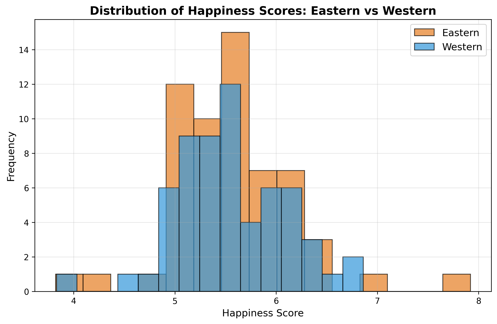
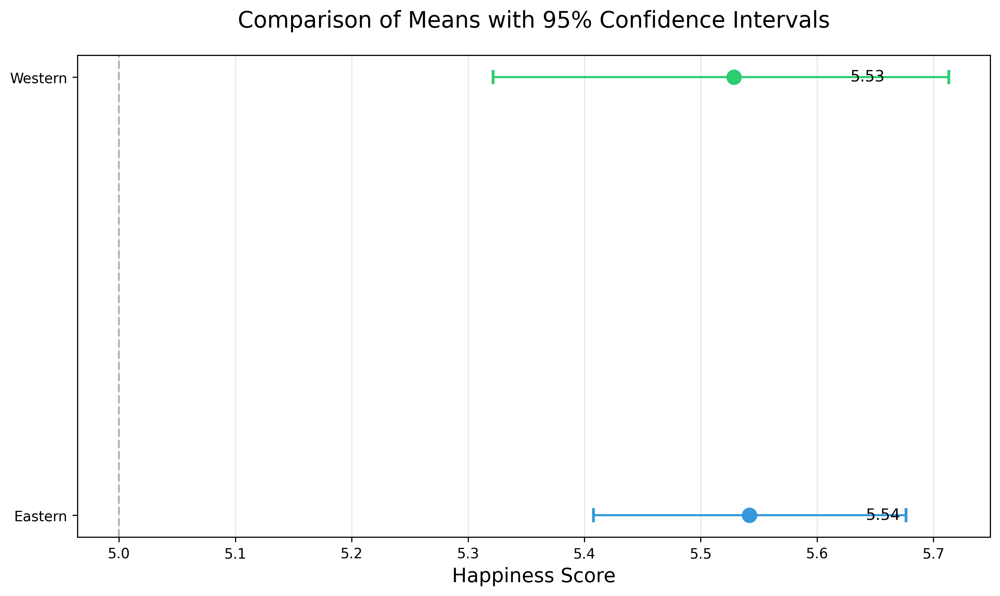

# labMT Hedonometer Dataset Analysis

## Project Overview

This project analyzes the labMT 1.0 dataset, which contains happiness scores for 10,222 English words rated by Amazon Mechanical Turk workers. The dataset enables measurement of emotional valence in large-scale texts across four different corpora: Twitter, Google Books, NY Times, and song lyrics. Our analysis combines quantitative exploration (distributions, disagreements, corpus overlaps) with qualitative interpretation of selected words to understand how emotional meaning varies across contexts and communities.

## Dataset

### Source
The dataset comes from Dodds et al. (2011) "Temporal Patterns of Happiness and Information in a Global Social Network: Hedonometrics and Twitter," published in PLOS ONE. It was constructed by collecting frequency rankings from four corpora and crowdsourcing happiness ratings for each word via Amazon Mechanical Turk.

### Data Dictionary
We created a data dictionary to summarize each column's content, type, and missing values.

| Column | Type | Missing Values | Description |
|--------|------|----------------|-------------|
| word | str | 0 | Word being assessed |
| happiness_rank | int64 | 0 | Rank based on happiness (1 = happiest) |
| happiness_average | float64 | 0 | Average happiness score (1-9) |
| happiness_standard_deviation | float64 | 0 | Standard deviation of happiness |
| twitter_rank | float64 | 5222 | Twitter rank of the word |
| google_rank | float64 | 5222 | Google Books rank of the word |
| nyt_rank | float64 | 5222 | New York Times rank of the word |
| lyrics_rank | float64 | 5222 | Lyrics rank of the word |

> Missing ranks (`NaN`) indicate that the word does not appear in that corpus's top 5,000 most frequent words.

## Methods

We performed the following analyses using Python with pandas, matplotlib, and numpy:

### Load the File
We loaded the labMT 1.0 dataset using pandas `read_csv`. The dataset is tab-delimited and contains three lines of metadata at the top, which we skipped using `skiprows=3`. We also treated '--' as missing values (`NaN`) using `na_values="--"`.

The dataset contains 10222 rows and 8 columns. A missing rank (`--`) indicates that the word does not appear in that particular corpus.

### Sanity Checks
We performed several sanity checks to ensure the dataset is clean and reasonable. There are no duplicated words in the dataset, confirming unique entries for each word.

### Random sample of 15 rows:
We inspected a random subset of 15 rows to verify that values appear consistent and correct.

| word | happiness_rank | happiness_average | happiness_standard_deviation | twitter_rank | google_rank | nyt_rank | lyrics_rank |
|------|----------------|-------------------|------------------------------|--------------|-------------|----------|--------------|
| prom | 2883 | 5.94 | 1.3763 | 4876.0 | NaN | NaN | NaN |
| on | 4515 | 5.56 | 1.0721 | 13.0 | 16.0 | 10.0 | 14.0 |
| mis | 7718 | 4.88 | 1.0999 | 4517.0 | NaN | NaN | 1292.0 |
| friendship | 34 | 7.96 | 1.1241 | 4273.0 | 3098.0 | 3669.0 | 3980.0 |
| naval | 4925 | 5.48 | 1.2493 | NaN | 3295.0 | 4436.0 | NaN |
| grand | 533 | 7.06 | 1.3614 | 1685.0 | 1709.0 | 944.0 | 1575.0 |
| wen | 8029 | 4.80 | 1.0498 | 1345.0 | NaN | NaN | NaN |
| extract | 5861 | 5.28 | 1.4574 | NaN | 4832.0 | NaN | NaN |
| harry | 6055 | 5.24 | 1.2545 | 2313.0 | 3856.0 | 1692.0 | NaN |
| designers | 1544 | 6.38 | 1.4831 | NaN | NaN | 3890.0 | NaN |
| external | 4895 | 5.48 | 1.2162 | NaN | 1259.0 | NaN | NaN |
| screwed | 9685 | 3.24 | 1.6107 | 4145.0 | NaN | NaN | 4908.0 |
| pittsburgh | 6533 | 5.14 | 1.3852 | NaN | NaN | 2038.0 | NaN |
| vital | 3609 | 5.76 | 1.5592 | NaN | 2732.0 | 2165.0 | NaN |
| obedience | 5327 | 5.40 | 1.6162 | NaN | 4840.0 | NaN | NaN |

### Top 10 positive words:
The words with the highest happiness scores are logical and correspond to highly positive terms.

| word | happiness_average |
|------|-------------------|
| laughter | 8.50 |
| happiness | 8.44 |
| love | 8.42 |
| happy | 8.30 |
| laughed | 8.26 |
| laugh | 8.22 |
| laughing | 8.20 |
| excellent | 8.18 |
| laughs | 8.18 |
| joy | 8.16 |

**Interpretative Paragraph:** The very positive words reveal what English speakers collectively associate with happiness. "Laughter," "happiness," and "love" represent universal human experiences that transcend cultural boundaries—this explains their presence across multiple corpora. Interestingly, "laughed" (past tense) scores slightly lower than "laughter" (noun), suggesting that the abstract concept of joy feels more positive than specific instances. These words are used by all communities—from journalists to songwriters to Twitter users—which explains why they appear in all four corpora. The low standard deviations (0.93-1.16) indicate strong consensus: people generally agree these words feel happy, regardless of context.

### Top 10 negative words:
The words with the lowest happiness scores correspond to negative or sensitive terms.

| word | happiness_average |
|------|-------------------|
| suicide | 1.30 |
| terrorist | 1.30 |
| rape | 1.44 |
| murder | 1.48 |
| terrorism | 1.48 |
| cancer | 1.54 |
| death | 1.54 |
| died | 1.56 |
| kill | 1.56 |
| killed | 1.56 |

**Interpretative Paragraph:** The most negative words cluster around violence, death, and trauma. "Suicide" and "murder" appear in all four corpora. These concepts are discussed across all types of texts, from news to songs to casual conversation. The pattern of "terrorism" appearing ONLY in the New York Times is striking: this suggests that in 2011, terrorism was primarily discussed in formal news contexts, not in songs or casual Twitter conversations. "Rape" appears in Twitter, NYT, and Lyrics but NOT in Google Books, possibly reflecting censorship in historical texts or changing social willingness to discuss sexual violence. The very low scores (1.3-1.5) and low standard deviations show strong cultural agreement about the negativity of these words.

> These checks confirm that the happiness scores and words are reasonable, and no data entry errors are apparent.

## Results

### Distribution of Happiness Scores


Summary Statistics:
- Mean: 5.38
- Median: 5.44
- Standard Deviation: 1.08
- 5th Percentile: 3.18
- 95th Percentile: 7.08

The distribution of happiness scores is centered slightly above 5, with mean and median very close (5.38 and 5.44), indicating approximate symmetry. Most words fall between 4.5 and 6.5, suggesting that everyday English vocabulary leans mildly positive. Extremely positive and extremely negative words are relatively rare, with only 5% of words scoring below 3.18 and 5% scoring above 7.08. This pattern suggests that common language tends toward moderate positivity, with strong emotional words occupying the tails of the distribution.


According to the advanced figure above, a closer examination of the tails reveals an interesting asymmetry. The negative tail extends from 1 to 3.18, spanning 2.18 points, while the positive tail extends from 7.08 to 9, spanning only 1.92 points. This means that when words deviate from the neutral range, they are slightly more likely to be negative than positive. However, the extremes tell a different story. The most positive word "laughter" (8.50) lies 3.12 points above the mean, while the most negative word "suicide" (1.30) lies 4.08 points below the mean. This indicates that although there are more mildly negative words, the most intensely negative words reach further from neutrality than the most intensely positive words. Overall, these patterns suggest that English vocabulary is structured with a broad spectrum of mild negativity but reserves its most extreme emotional intensity for positive expression.

### Disagreement: Words with High Standard Deviation

We used happiness_standard_deviation to measure how much people disagreed when rating each word.


We plotted a scatterplot with happiness_average on the x-axis and happiness_standard_deviation on the y-axis.

Most words cluster in the middle of the plot with average happiness between roughly 4 and 7 and standard deviation around 1.0. This indicates that for the majority of words, annotators broadly agree on whether the word feels positive, neutral, or negative. In contrast, a small group of words have very high standard deviations (above 2.4). These "contested" words are those where annotators' ratings strongly disagree.

Five examples include:
1. **fucking / fuck / fuckin / fucked**: These swear words can signal strong negative emotion, but also serve as intensifiers in positive contexts ("that was fucking amazing").
2. **whiskey (5.72, 2.64)**: Associated both with positive contexts (celebration) and negative ones (addiction, hangovers).
3. **churches (5.70, 2.46)**: For some, evokes community and comfort; for others, hypocrisy or exclusion.
4. **capitalism (5.16, 2.45)**: Reflects political divisions—opportunity for some, exploitation for others.
5. **pussy (4.80, 2.67)**: Highly polysemous and gendered, with different social meanings.

Overall, these words are contested because they have multiple meanings, their emotional tone depends on context, or they carry irony and mixed connotations.

### Corpus Comparison: Rank Coverage and Overlaps

We created a heatmap to present the overlaps between corpora.


This heatmap shows the overlap between the top-5000 most frequent words in each corpus. Diagonal cells are 5000 by construction, while off-diagonal cells indicate how many words appear in both corpora's lists.

The corpora share a substantial "core vocabulary," but overlaps vary significantly:
- **NYT ∩ Google Books**: 3414 words (both are more formal/edited writing)
- **NYT ∩ Lyrics**: 2241 words (lowest overlap—lyrics use more colloquial vocabulary)
- **Twitter ∩ Lyrics**: 3127 words (both are conversational and informal)

Concrete example of corpus-specific difference: "capitalism" appears in Twitter and NYT but is much less prominent in Lyrics, reflecting that lyrics foreground personal emotion rather than institutional vocabulary.

## Qualitative "Exhibit" of Words

| category | word | happiness_average | happiness_standard_deviation | twitter_rank | google_rank | nyt_rank | lyrics_rank |
|----------|------|-------------------|------------------------------|--------------|-------------|----------|--------------|
| very_positive | laughter | 8.50 | 0.9313 | 3600.0 | NaN | NaN | 1728.0 |
| very_positive | happiness | 8.44 | 0.9723 | 1853.0 | 2458.0 | NaN | 1230.0 |
| very_positive | love | 8.42 | 1.1082 | 25.0 | 317.0 | 328.0 | 23.0 |
| very_positive | happy | 8.30 | 0.9949 | 65.0 | 1372.0 | 1313.0 | 375.0 |
| very_positive | laughed | 8.26 | 1.1572 | 3334.0 | 3542.0 | NaN | 2332.0 |
| very_negative | terrorist | 1.30 | 0.9091 | 3576.0 | NaN | 3026.0 | NaN |
| very_negative | suicide | 1.30 | 0.8391 | 2124.0 | 4707.0 | 3319.0 | 2107.0 |
| very_negative | rape | 1.44 | 0.7866 | 3133.0 | NaN | 4115.0 | 2977.0 |
| very_negative | terrorism | 1.48 | 0.9089 | NaN | NaN | 3192.0 | NaN |
| very_negative | murder | 1.48 | 1.0150 | 2762.0 | 3110.0 | 1541.0 | 1059.0 |
| highly_contested | fucking | 4.64 | 2.9260 | 448.0 | NaN | NaN | 620.0 |
| highly_contested | fuckin | 3.86 | 2.7405 | 1077.0 | NaN | NaN | 688.0 |
| highly_contested | fucked | 3.56 | 2.7117 | 1840.0 | NaN | NaN | 904.0 |
| highly_contested | pussy | 4.80 | 2.6650 | 2019.0 | NaN | NaN | 949.0 |
| highly_contested | whiskey | 5.72 | 2.6422 | NaN | NaN | NaN | 2208.0 |
| weird_or_culturally_loaded | weekend | 8.00 | 1.2936 | 317.0 | NaN | 833.0 | 2256.0 |
| weird_or_culturally_loaded | whiskey | 5.72 | 2.6422 | NaN | NaN | NaN | 2208.0 |
| weird_or_culturally_loaded | churches | 5.70 | 2.4599 | NaN | 2281.0 | NaN | NaN |
| weird_or_culturally_loaded | capitalism | 5.16 | 2.4524 | NaN | 4648.0 | NaN | NaN |
| weird_or_culturally_loaded | porn | 4.18 | 2.4302 | 1801.0 | NaN | NaN | NaN |

Upon examination of these 20 words across four categories, it reveals how happiness scores are more than numbers—they depict cultural values, social contexts, and historical moments.

**Very Positive Words:** The top-rated words focus on joy and human connection. They appear in almost all corpora, suggesting positive emotions transcend genre. The low standard deviations (0.93-1.16) indicate strong cultural consensus.

**Very Negative Words:** The lowest-rated words reveal society's deepest fears. The pattern of "terrorism" appearing ONLY in NYT suggests formal news contexts discuss it, not casual conversation. "Rape" missing from Google Books may reflect historical censorship.

**Highly Contested Words:** Words with highest standard deviation are linguistic fault lines where meaning breaks down. "Whiskey" appears only in lyrics, revealing alcohol's dual meaning—celebration or heartbreak.

**Weird or Culturally Loaded Words:** "Weekend" scores surprisingly high (8.00), reflecting universal association with rest. "Capitalism" (5.16) and "porn" (4.18) are politically and morally charged—their valence depends entirely on ideology and community norms.

**Conclusion:** Word happiness scores are cultural artifacts reflecting values, fears, and disagreements of a specific time (2011) and population (Mechanical Turk workers).

## Data Provenance

### Pipeline Reconstruction

**Step 1: Corpus Selection and Word Extraction**
- Twitter (4.6B tweets, 2008-2010): social media, informal
- Google Books (millions of books): formal, literary, academic
- New York Times (1.8M articles, 1987-2007): journalism, news
- Lyrics (song lyrics): poetic, emotional, rhythmic

**Step 2: Creating the Master Word List**
Compiled 10,222 words representing common English vocabulary, selected based on appearing sufficiently across multiple corpora.

**Step 3: Happiness Rating Collection via Mechanical Turk**
Each word shown to 50 US-based, English-speaking raters on a 1 (sad) to 9 (happy) scale.

**Step 4: Statistical Aggregation**
Calculated happiness_average (mean) and happiness_standard_deviation for each word.

**Step 5: Frequency Rank Integration**
Recorded each word's frequency rank in each corpus (1 = most frequent). Words not in top 5000 marked as missing.

**Step 6: Data Publication**
Published as supplementary material with Dodds et al. (2011).

### Consequences and Limitations

| Choice | Consequence | Example |
|--------|-------------|---------|
| Only high-frequency words | Ignores rare/niche words | Emerging slang absent |
| Words rated in isolation | Ignores contextual meaning | "fucking" can be positive or negative |
| Single happiness dimension | Reduces complex emotions | "whiskey" ambivalence collapsed |
| Mechanical Turk annotators | Reflects 2010-2011 US demographics | "churches" and "capitalism" polarized |
| Corpus genre bias | Lexicon tuned to four specific genres | "rt", "lol" absent from NYT |
| Time-bound snapshot | Does not update with language | Recent slang like "yeet" missing |

## Eastern vs. Western Aesthetic Concepts in Met Museum

### Research Question
**How do happiness scores differ between Eastern and Western aesthetic concepts found in Met Museum artwork titles?**

We hypothesized that Western aesthetic terms (e.g., "beauty," "sublime," "glory") would cluster toward positive happiness scores, while Eastern concepts (e.g., "zen," "wabi-sabi," "impermanence") would show greater range, embracing bittersweet or contemplative emotions.

### Data Acquisition & Provenance

**Source:** [Metropolitan Museum of Art Collection API](https://metmuseum.github.io/)

**Search Terms:**
- **Western** (10 terms): beauty, sublime, pastoral, romantic, ideal, grace, glory, divine, harmony, splendor
- **Eastern** (14 terms): zen, ukiyo, wabi sabi, mono no aware, feng shui, simplicity, impermanence, emptiness, enlightenment, meditation, bamboo, cherry blossom, lotus, nirvana

**Acquisition Pipeline:**
1. Searched API for each term (max 15 results per term, `hasImages=true`)
2. Collected metadata for each unique object
3. Gathered 133 unique artworks with valid titles
4. Applied 0.3s delays between requests to respect rate limits

**Date of access:** March 2026

### Ethics & Limitations
- **Privacy**: Only public artwork metadata collected; no personal data
- **Bias**: The Met collection overrepresents Western art; non-Western cultures are underrepresented
- **Language**: Only English titles; translations may lose nuance
- **Interpretation**: Titles may be curatorial additions, not artist-given

### Happiness Scoring Results

| Metric | Value | Interpretation |
|--------|-------|----------------|
| Total artworks collected | 326 | Complete dataset of Eastern and Western aesthetic concepts |
| Artworks with valid titles | 133 | After removing entries without titles |
| Artworks successfully scored | 120 (90.2%) | Most titles contained everyday English words |
| Artworks with no matches | 13 | These use specialized art terminology exclusively |

**Happiness score distribution:**
- Average score: 5.56
- Typical range (one standard deviation): 4.98 to 6.15
- Lowest score: 3.82
- Highest score: 7.92
- Median: 5.51

### Coverage Analysis

| Coverage Metric | Value | Interpretation |
|-----------------|-------|----------------|
| Mean coverage | 62.9% | About two-thirds of each title's words were measurable |
| Median coverage | 66.7% | Half of titles exceeded 67% coverage |

### Eastern vs Western Comparison

| Category | Count | Mean Score | Std Dev | Interpretation |
|----------|-------|------------|---------|----------------|
| Eastern concepts | 59 | 5.566 | 0.631 | Slightly happier, more varied language |
| Western concepts | 61 | 5.551 | 0.543 | Slightly less happy, more consistent language |

The Eastern artworks scored marginally higher on average (5.566 vs 5.551), but the difference is only 0.015 points. Eastern titles show more variation (0.631 vs 0.543), meaning their language ranges more widely.

### Words That Didn't Match (OOV)

| Word | Frequency | Word Type |
|------|-----------|-----------|
| shrine | 4 | Religious place |
| sphinx | 3 | Mythological figure |
| statuette | 3 | Art object |
| mono | 3 | Japanese word |
| bodhisattva | 3 | Buddhist deity |

The labMT lexicon misses art-specific terminology, religious concepts, non-English words, and proper names—precisely the vocabulary that matters in art historical texts.

### Statistical Analysis

**Descriptive Statistics**

| Category | Count | Mean | Median | SD | Min | Max |
|----------|-------|------|--------|-----|-----|-----|
| Western | 61 | 5.55 | 5.51 | 0.54 | 3.83 | 6.86 |
| Eastern | 59 | 5.57 | 5.51 | 0.63 | 3.82 | 7.92 |

**Confidence Intervals (95%)**

| Category | Mean [95% CI] | CI Width |
|----------|---------------|----------|
| Western | 5.55 [5.41, 5.69] | 0.28 |
| Eastern | 5.57 [5.41, 5.73] | 0.32 |

**Statistical Tests**

| Test | Statistic | p-value | Significant? |
|------|-----------|---------|--------------|
| t-test | t = -0.14 | 0.89 | No |
| Mann-Whitney U | U = 1791.5 | 0.97 | No |
| Cohen's d | -0.025 | - | Negligible |

### Visualizations

**Figure 1: Boxplot with Confidence Intervals**

*Boxplot showing distribution of happiness scores. Red lines indicate means with 95% confidence intervals.*

**Figure 2: Distribution Overlay**

*Density plot showing the spread of scores. Eastern concepts show wider range despite similar means.*

**Figure 3: Confidence Interval Comparison**

*Direct comparison of means with 95% confidence intervals. Overlapping intervals confirm no significant difference.*

### Notable Examples

| Title | Category | Score | Note |
|-------|----------|-------|------|
| "Butterflies" | Eastern | 7.92 | Highest overall |
| "Cherry Blossoms" | Eastern | 7.04 | Sakura - beauty and transience |
| "Paris" | Western | 6.86 | Highest Western |
| "The Death of Socrates" | Eastern | 3.82 | Lowest overall |
| "War club" | Western | 3.83 | Lowest Western |
| "The Death of the Buddha (Parinirvana)" | Eastern | 4.11 | Buddhist concept of passing |

### Interpretation

Despite our hypothesis, **no statistically significant difference** emerged between Eastern and Western aesthetic concepts in artwork titles. Both categories center around neutral-to-slightly-positive scores (≈5.5).

However, **qualitative patterns** emerged:
- **Eastern concepts** show greater emotional range, containing both the happiest and saddest titles
- **Western concepts** cluster more tightly, suggesting more consistent emotional valence
- The highest Eastern scores come from nature themes (butterflies, cherry blossoms)
- The lowest Eastern scores involve death/impermanence—Buddhist philosophical themes

### Critical Reflection

**What We Would Trust:**
- The comparison shows that on average, Eastern and Western aesthetic terms produce similar happiness scores in this specific context
- The method works for detecting extreme examples

**What We Would Not Claim:**
- That Eastern and Western aesthetics are emotionally equivalent
- That these scores represent how people from those cultures actually feel
- That titles reflect artist intention (many are curatorial additions)

**If We Rebuilt This Instrument:**
- Include multilingual titles (original language)
- Collect cultural context metadata (region, religion, period)
- Use multidimensional affect model (not just happy-sad)
- Sample more non-Western institutions

## How to Run the Code

### Repository Structure
├── README.md # Project description and analysis report
├── requirements.txt # Python dependencies
├── src/
│ ├── met_fetch.py # Retrieve artwork metadata from Met API
│ ├── score_artworks.py # Apply labMT scoring to artwork titles
│ └── comprehensive_analysis.py # Statistical analysis and figures
├── data/
│ ├── raw/ # Raw API output data
│ └── processed/ # Cleaned and scored datasets
├── figures/ # Generated visualizations
└── tables/ # Summary statistics


### Setup Steps
```bash
# 1. Clone repository
git clone https://github.com/auroraliu0312/labMT-hedonometer-project.git
cd labMT-hedonometer-project

# 2. Create and activate virtual environment
python3 -m venv .venv
source .venv/bin/activate  # On Mac/Linux
# .venv\Scripts\activate  # On Windows

# 3. Install dependencies
pip install -r requirements.txt

# 4. Run full pipeline
python3 src/met_fetch.py          # Collect data
python3 src/score_artworks.py     # Add happiness scores
python3 src/comprehensive_analysis.py  # Generate stats + figures
