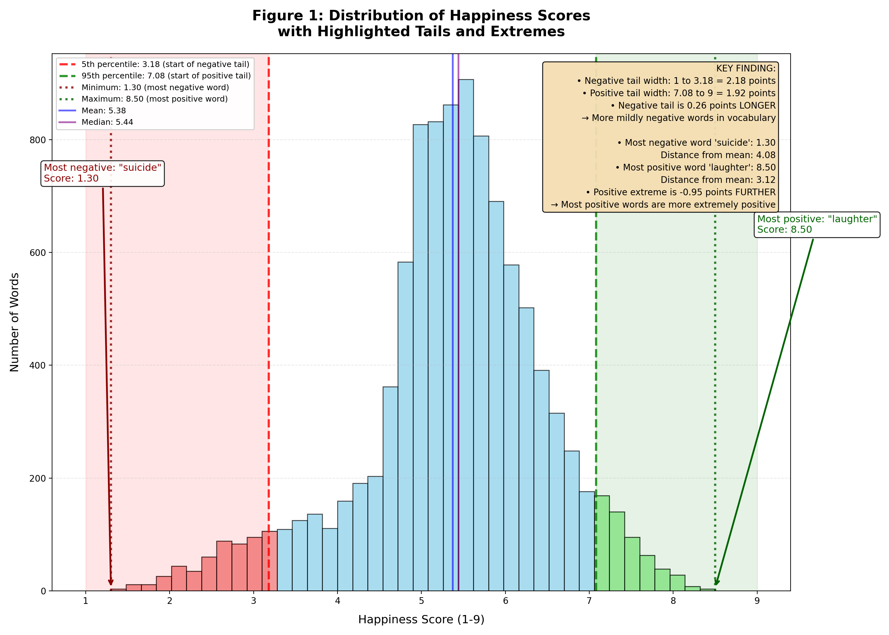
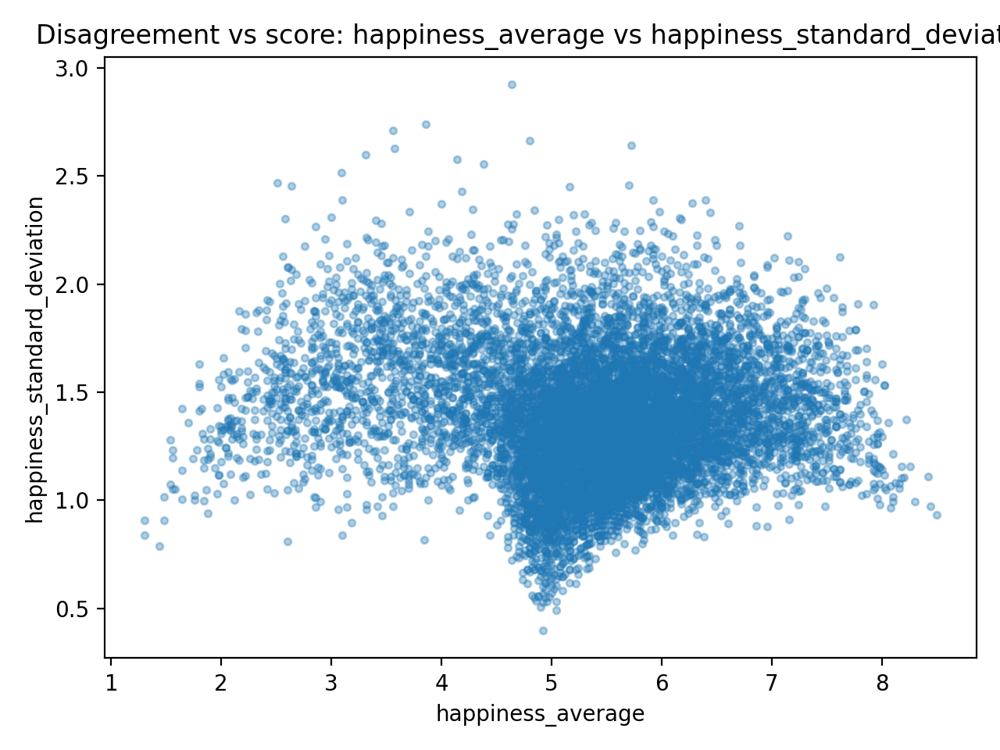
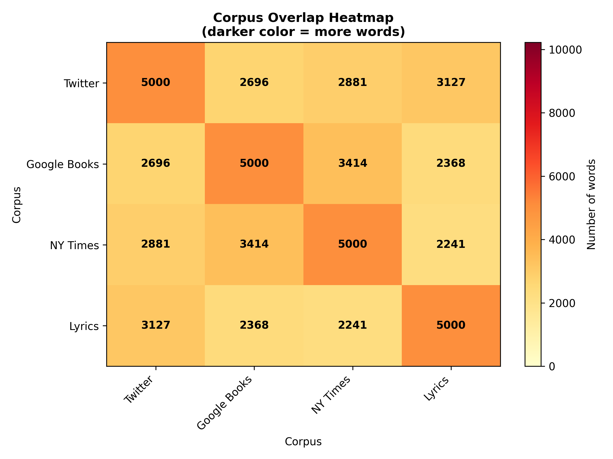
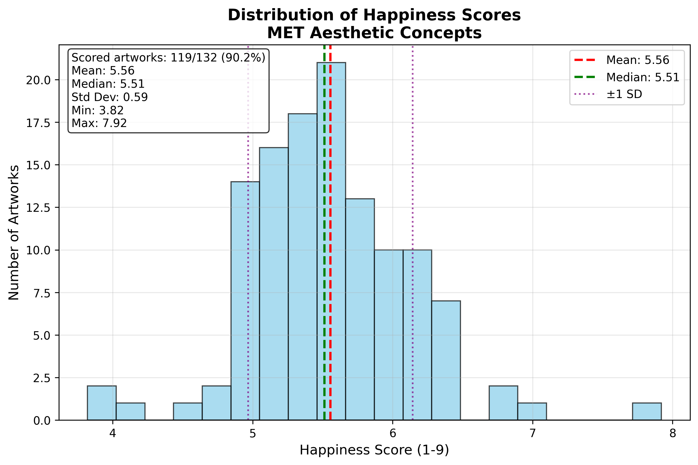
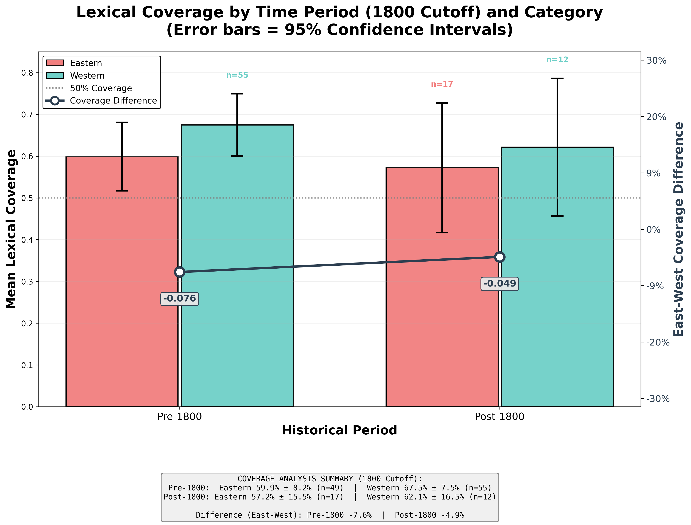
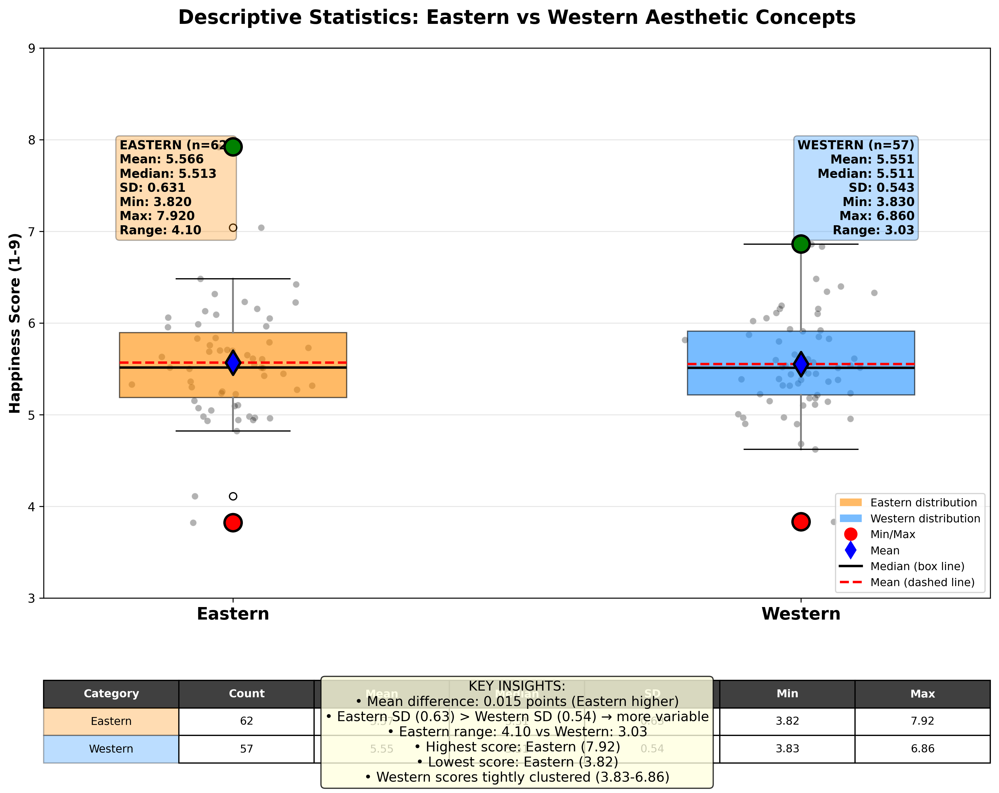
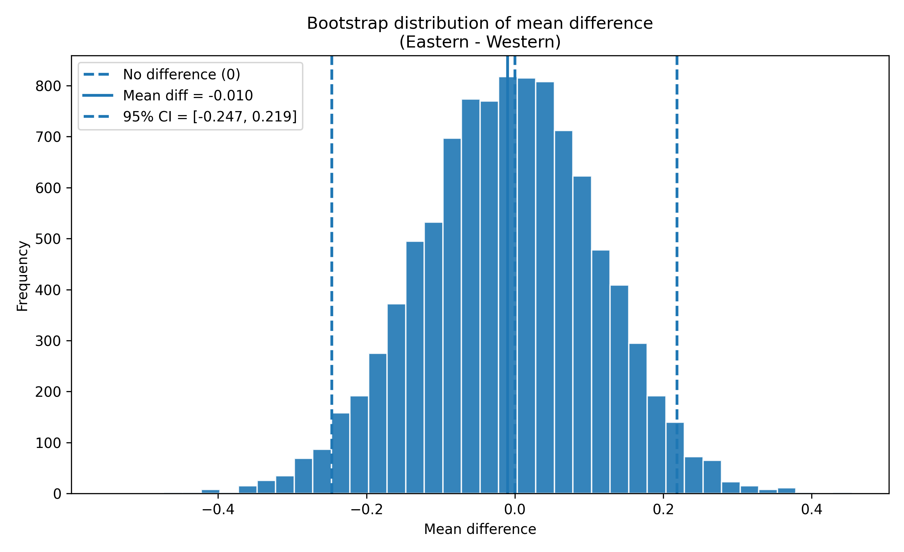
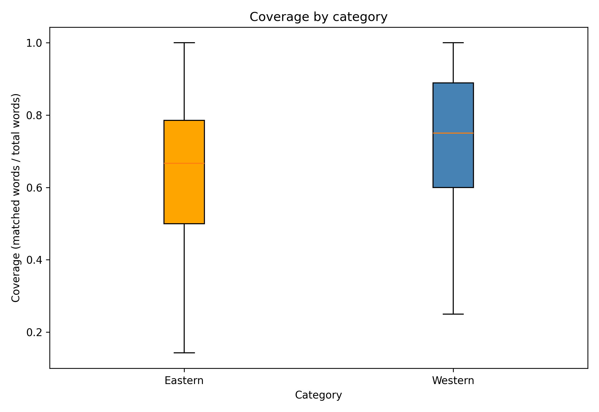

# labMT Hedonometer Dataset Analysis

# Project Overview

This project analyzes the labMT 1.0 dataset, which contains happiness scores for 10,222 English words rated by Amazon Mechanical Turk workers. The dataset enables measurement of emotional valence in large-scale texts across four different corpora: Twitter, Google Books, NY Times, and song lyrics. Our analysis combines quantitative exploration (distributions, disagreements, corpus overlaps) with qualitative interpretation of selected words to understand how emotional meaning varies across contexts and communities. Building on this foundation, we extend the hedonometer methodology to the artwork titles from the Metropolitan Museum of Art. By applying the same scoring procedure to titles associated with Eastern and Western aesthetic concepts, we investigate whether emotional language differs across cultural traditions in the context of museum collections.Based on our findings, we offer critical reflections on the limitations of applying a general purpose sentiment lexicon to specialized texts. We conclude with concrete recommendations for improving the hedonometer instrument and multidimensional affect models to better capture the nuanced emotional language of art historical and culturally diverse corpora.

## Dataset

- Source

The dataset is from Dodds et al. (2011) "Temporal Patterns of Happiness and Information in a Global Social Network:  Hedonometrics and Twitter," published in PLOS ONE. It was constructed by collecting frequency rankings from four corpora and crowdsourcing happiness ratings for each word via Amazon Mechanical Turk.

- Data Dictionary

We created a data dictionary to summarize each column's content, type, and missing values.

| Column                      | Type    | Missing Values | Description                              |
|----------------------------| ---------|----------------|------------------------------------------|
| word                        | str     | 0              | Word being assessed                      |
| happiness_rank              | int64   | 0              | Rank based on happiness (1 = happiest)   |
| happiness_average           | float64 | 0              | Average happiness score (1-9)            |
| happiness_standard_deviation| float64 | 0              | Standard deviation of happiness          |
| twitter_rank                | float64 | 5222           | Twitter rank of the word                 |
| google_rank                 | float64 | 5222           | Google Books rank of the word            |
| nyt_rank                    | float64 | 5222           | New York Times rank of the word          |
| lyrics_rank                 | float64 | 5222           | Lyrics rank of the word                  |

> Missing ranks (`NaN`) indicate that the word does not appear in that corpus's top 5,000 most frequent words.

# Methods

We performed the following analyses using Python with pandas, matplotlib, and numpy:

## Load the File

We loaded the labMT 1.0 dataset using pandas `read_csv`. The dataset is tab-delimited and contains three lines of metadata at the top, which we skipped using `skiprows=3`. We also treated '--' as missing values (`NaN`) using `na_values="--"`.

The dataset contains 10222 rows and 8 columns.  

A missing rank (`--`) indicates that the word does not appear in that particular corpus.

## Sanity Checks

We performed several sanity checks to ensure the dataset is clean and reasonable.

There are no duplicated words in the dataset, confirming unique entries for each word.

## Random sample of 15 rows:
 We inspected a random subset of 15 rows to verify that values appear consistent and correct. Example sample:

| word | happiness_rank | happiness_average | happiness_standard_deviation | twitter_rank | google_rank | nyt_rank | lyrics_rank |
|------|----------------|-------------------|------------------------------|--------------|-------------|----------|--------------|
| prom | 2883 | 5.94 | 1.3763 | 4876.0 | NaN | NaN | NaN |
| on | 4515 | 5.56 | 1.0721 | 13.0 | 16.0 | 10.0 | 14.0 |
| mis | 7718 | 4.88 | 1.0999 | 4517.0 | NaN | NaN | 1292.0 |
| friendship | 34 | 7.96 | 1.1241 | 4273.0 | 3098.0 | 3669.0 | 3980.0 |
| naval | 4925 | 5.48 | 1.2493 | NaN | 3295.0 | 4436.0 | NaN |
| grand | 533 | 7.06 | 1.3614 | 1685.0 | 1709.0 | 944.0 | 1575.0 |
| wen | 8029 | 4.80 | 1.0498 | 1345.0 | NaN | NaN | NaN |
| extract | 5861 | 5.28 | 1.4574 | NaN | 4832.0 | NaN | NaN |
| harry | 6055 | 5.24 | 1.2545 | 2313.0 | 3856.0 | 1692.0 | NaN |
| designers | 1544 | 6.38 | 1.4831 | NaN | NaN | 3890.0 | NaN |
| external | 4895 | 5.48 | 1.2162 | NaN | 1259.0 | NaN | NaN |
| screwed | 9685 | 3.24 | 1.6107 | 4145.0 | NaN | NaN | 4908.0 |
| pittsburgh | 6533 | 5.14 | 1.3852 | NaN | NaN | 2038.0 | NaN |
| vital | 3609 | 5.76 | 1.5592 | NaN | 2732.0 | 2165.0 | NaN |
| obedience | 5327 | 5.40 | 1.6162 | NaN | 4840.0 | NaN | NaN |

## Top 10 positive words:
The words with the highest happiness scores are logical and correspond to highly positive terms. 

| word      |happiness_average|
|-----------|-----------------|
| laughter  | 8.50            |
| happiness | 8.44            |
| love      | 8.42            |
| happy     | 8.30            |
| laughed   | 8.26            |
| laugh     | 8.22            |
| laughing  | 8.20            |
| excellent | 8.18            |
| laughs    | 8.18            |
| joy       | 8.16            |

- We noticed that the very positive words reveal what English speakers collectively associate with happiness. "Laughter," "happiness," and "love" represent universal human experiences that transcend cultural boundaries, explaining their presence across multiple corpora. Interestingly, "laughed" (past tense) scores slightly lower than "laughter" (noun), suggesting that the abstract concept of joy feels more positive than specific instances. These words appear in all four corpora, being used by all types of communities from journalists to songwriters to Twitter users. The low standard deviations (0.93-1.16) indicate a strong consensus, in which, people generally agree these words feel happy, regardless of context.

## Top 10 negative words:

The words with the lowest happiness scores correspond to negative or sensitive terms.

| word       | happiness_average |
|-----------|-----------------|
| suicide   | 1.30            |
| terrorist | 1.30            |
| rape      | 1.44            |
| murder    | 1.48            |
| terrorism | 1.48            |
| cancer    | 1.54            |
| death     | 1.54            |
| died      | 1.56            |
| kill      | 1.56            |
| killed    | 1.56            |

- We observed that most negative words cluster around violence, death, and trauma. "Suicide" and "murder" appear in all four corpora. These concepts are discussed across all types of texts from news to songs to casual conversation. The pattern of "terrorism" appearing only in the New York Times is striking: this suggests that in 2011, terrorism was primarily discussed in formal news contexts, not in songs or casual Twitter conversations. "Rape" appears in Twitter, NYT, and Lyrics but not in Google Books. This possibly reflecting censorship in historical texts or changing social willingness to discuss sexual violence.The very low scores (1.3-1.5) and low standard deviations show strong cultural agreement about the negativity of these words. 

> These checks confirm that the happiness scores and words are reasonable, and no data entry errors are apparent.

# Results

## Distribution of Happiness Scores

Summary Statistics:
- Mean: 5.38
- Median: 5.44
- Standard Deviation: 1.08
- 5th Percentile: 3.18
- 95th Percentile: 7.08

The distribution of happiness scores is centered slightly above 5, with mean and median very close (5.38 and 5.44), indicating approximate symmetry. Most words fall between 4.5 and 6.5, suggesting that everyday English vocabulary leans mildly positive. Extremely positive and extremely negative words are relatively rare, with only 5% of words scoring below 3.18 and 5% scoring above 7.08. This pattern suggests that common language tends toward moderate positivity, with strong emotional words occupying the tails of the distribution.

An interesting pattern is the distribution reveals the negative tail (scores below 3.18) is slightly longer than the positive tail (scores above 7.08). This means that when words do deviate from the neutral range, they are slightly more likely to be negative than positive. However, the overall mass of the distribution sits in the 5-6 range, indicating that everyday language maintains a mild positivity bias. This suggests that English vocabulary has a wider range of mildly negative words, but the most intensely positive words are more extremely positive than the most intensely negative words are extremely negative. 

According to the figure  above, a closer examination of the tails reveals an interesting asymmetry. The negative tail extends from 1 to 3.18, spanning 2.18 points, while the positive tail extends from 7.08 to 9, spanning only 1.92 points. This means that when words deviate from the neutral range, they are slightly more likely to be negative than positive English vocabulary. However, the extremes tell a different story. The most positive word "laughter" (8.50) lies 3.12 points above the mean, while the most negative word "suicide" (1.30) lies 4.08 points below the mean. This indicates that although there are more mildly negative words, the most intensely negative words reach further from neutrality than the most intensely positive words. Overall, these patterns suggest that English vocabulary is structured with a broad spectrum of mild negativity but reserves its most extreme emotional intensity for positive expression. The strongly negative words (very low scores) are much less common than neutral or slightly positive words. This suggests that common language tends to lean slightly positive overall.

## Disagreement: Words with High Standard Deviation

We used happiness_standard_deviation to measure how much people disagreed when rating each word.

We plotted a scatterplot with:
happiness_average on the x-axis
happiness_standard_deviation on the y-axis

Most words cluster in the middle of the plot. Their average happiness lies between roughly 4 and 7, and their standard deviation is around 1.0. This indicates that for the majority of words, annotators broadly agree on whether the word feels positive, neutral, or negative. In contrast, a small group of words have very high standard deviations (above 2.4). These “contested” words are those where annotators’ ratings strongly disagree.

Five examples include:
1. fucking / fuck / fuckin / fucked
These are very frequent swear words in contemporary English. They can signal strong negative emotion (“fucking awful”), but also serve as intensifiers in positive or humorous contexts (“that was fucking amazing”). Some annotators may rate them as very negative because of their taboo/insulting usage, while others may focus on their role as casual emphasis and assign more neutral or even mildly positive ratings. This mixture of offensiveness and playful emphasis likely produces the very high standard deviations we see.

2. whiskey (5.72, 2.64)
On the surface, “whiskey” is a relatively neutral object word. However, it is associated both with positive contexts (celebration, relaxation, craft culture) and negative ones (addiction, hangovers, self-destructive behavior). People who associate it with convivial, social drinking might rate it as positive, while others who associate it with alcoholism or “drinking to cope” might rate it as negative. This ambivalence around alcohol fits its high standard deviation.

3. churches (5.70, 2.46)
“Churches” has an average happiness slightly above 5, but a very large standard deviation. For some annotators, churches may evoke community, comfort, and spirituality; for others, they may evoke hypocrisy, exclusion, or painful personal experiences. Because religion is a deeply personal and culturally contingent topic, it makes sense that the emotional charge of “churches” varies widely across raters.

4. capitalism (5.16, 2.45)
“Capitalism” sits near the middle in average happiness, but with large disagreement. This reflects contemporary political and ideological divisions. Some annotators may view capitalism as synonymous with opportunity, innovation, and freedom. However, others may associate it with inequality, exploitation, and crisis. The word is strongly politicized, so we should expect its emotional valence to differ substantially across individuals.

5. pussy (4.80, 2.67)
This word is highly polysemous and gendered. It can be used as an insult (especially towards men, implying weakness), as a sexual term, and in some contexts as a reclaimed or playful expression. Different annotators may respond to different senses and social norms around sexism and sexuality, leading to wide disagreement in how “happy” or “unhappy” the word feels.

The quantitative pattern (high standard deviation) reflects qualitative ambiguity. Words that allow multiple interpretations naturally produce more disagreement among raters. In this sense, standard deviation does not merely capture rating noise, it indexes cultural contestation and semantic instability.

Beyond identifying individual contested words, the overall shape of the scatterplot also reveals an important structural pattern. The points form a V-shaped distribution centered around happiness scores near 5. Words with average scores close to the midpoint (around 5) tend to have lower standard deviations, meaning that annotators largely agree that these words are emotionally neutral or only mildly positive or negative.

In contrast, words with more extreme average scores (very positive or very negative) tend to show greater horizontal spread and higher standard deviations. This occurs because emotionally charged words often evoke multiple interpretations depending on context, personal experience, or cultural background. For example, strongly negative words may be interpreted either literally (e.g., violence or suffering) or metaphorically (e.g., dramatic emphasis), while highly positive words may carry ironic or sarcastic uses. As a result, the further a word’s average happiness moves away from the neutral midpoint, the more room there is for disagreement among raters. This produces the wider “petals” of the plot at the extremes. The visual pattern therefore suggests that emotional intensity is associated with interpretive variability: strongly valenced words are not only emotionally charged but also socially and contextually contested.

## Corpus comparison: rank coverage and overlaps
We created a heatmap to present the overlaps between corpora

This is a heatmap-like overlap matrix. It shows the overlap between the top-5000 most frequent words in each corpus. Diagonal cells are 5000 by construction (each corpus contributes its top-5000 words), while off-diagonal cells indicate how many words appear in both corpora’s lists.

The corpora share a substantial “core vocabulary,” but overlaps vary a lot depending on the pair:
•	NYT ∩ Google Books is relatively high (3414) → both are more formal/edited writing, so their frequent vocabulary overlaps more.
•	NYT ∩ Lyrics is relatively low (2241) → lyrics include more colloquial, stylized, and genre-specific vocabulary that doesn’t appear as often in newspaper prose.
•	Twitter overlaps strongly with Lyrics (3127) → both contexts are more conversational and informal, so they share more common slang / everyday terms.

Overall, the corpora share a substantial “core vocabulary,” but the overlaps vary significantly depending on the pair. The highest overlap occurs between NY Times and Google Books (3414 words). This is expected because both corpora primarily consist of edited, formal written English. Newspapers and books share stylistic conventions such as standardized grammar, institutional topics (politics, economy, public life), and relatively conservative vocabulary. As a result, the most frequent words in these corpora tend to converge.

In contrast, NY Times and Lyrics show the lowest overlap (2241 words). This difference reflects not only the level of formality but also the communicative purpose of the texts. News writing prioritizes informational clarity and institutional discourse, while song lyrics emphasize emotion, rhythm, and personal expression. Lyrics therefore contain more figurative language, repetition, slang, and genre-specific vocabulary that rarely appears in journalistic prose.

Interestingly, Twitter overlaps more strongly with Lyrics (3127 words) than Lyrics does with NY Times. This pattern suggests that conversational and expressive forms of language share a common vocabulary across platforms. Both Twitter posts and song lyrics frequently include informal phrasing, everyday emotional language, and slang. However, this similarity may also reflect a methodological factor: both corpora capture more spontaneous or performative language, whereas the NY Times corpus reflects heavily edited institutional writing.

At the same time, these overlaps should be interpreted cautiously because they depend on how the corpora were constructed. Each dataset only includes the top-5000 most frequent words, which emphasizes common vocabulary and suppresses rare or specialized terms. As a result, the overlap matrix reflects similarities in high-frequency functional language rather than the full diversity of each corpus. In other words, the heatmap captures how everyday English circulates across genres, but it does not fully represent domain-specific or culturally distinctive vocabulary.

Concrete example of corpus-specific difference: “capitalism.”
It appears in Twitter and NYT but is much less prominent in Lyrics. This reflects communicative differences:
	•	Twitter and NYT contain political and institutional discourse.
	•	Lyrics foreground personal emotion, identity, and narrative voice rather than institutional vocabulary.
Similarly, slang or profanity terms (e.g., “fucking”) tend to appear in Twitter and Lyrics but are less common in formal corpora like Google Books, reflecting editorial filtering and stylistic norms.

# Qualitative “exhibit” of words

| category | word | happiness_average | happiness_standard_deviation | twitter_rank | google_rank | nyt_rank | lyrics_rank |
|----------|------|-------------------|------------------------------|--------------|-------------|----------|--------------|
| very_positive | laughter | 8.50 | 0.9313 | 3600.0 | NaN | NaN | 1728.0 |
| very_positive | happiness | 8.44 | 0.9723 | 1853.0 | 2458.0 | NaN | 1230.0 |
| very_positive | love | 8.42 | 1.1082 | 25.0 | 317.0 | 328.0 | 23.0 |
| very_positive | happy | 8.30 | 0.9949 | 65.0 | 1372.0 | 1313.0 | 375.0 |
| very_positive | laughed | 8.26 | 1.1572 | 3334.0 | 3542.0 | NaN | 2332.0 |
| very_negative | terrorist | 1.30 | 0.9091 | 3576.0 | NaN | 3026.0 | NaN |
| very_negative | suicide | 1.30 | 0.8391 | 2124.0 | 4707.0 | 3319.0 | 2107.0 |
| very_negative | rape | 1.44 | 0.7866 | 3133.0 | NaN | 4115.0 | 2977.0 |
| very_negative | terrorism | 1.48 | 0.9089 | NaN | NaN | 3192.0 | NaN |
| very_negative | murder | 1.48 | 1.0150 | 2762.0 | 3110.0 | 1541.0 | 1059.0 |
| highly_contested | fucking | 4.64 | 2.9260 | 448.0 | NaN | NaN | 620.0 |
| highly_contested | fuckin | 3.86 | 2.7405 | 1077.0 | NaN | NaN | 688.0 |
| highly_contested | fucked | 3.56 | 2.7117 | 1840.0 | NaN | NaN | 904.0 |
| highly_contested | pussy | 4.80 | 2.6650 | 2019.0 | NaN | NaN | 949.0 |
| highly_contested | whiskey | 5.72 | 2.6422 | NaN | NaN | NaN | 2208.0 |
| weird_or_culturally_loaded | weekend | 8.00 | 1.2936 | 317.0 | NaN | 833.0 | 2256.0 |
| weird_or_culturally_loaded | whiskey | 5.72 | 2.6422 | NaN | NaN | NaN | 2208.0 |
| weird_or_culturally_loaded | churches | 5.70 | 2.4599 | NaN | 2281.0 | NaN | NaN |
| weird_or_culturally_loaded | capitalism | 5.16 | 2.4524 | NaN | 4648.0 | NaN | NaN |
| weird_or_culturally_loaded | porn | 4.18 | 2.4302 | 1801.0 | NaN | NaN | NaN |

Upon examination of these 20 words across four categories, it reveals how happiness scores are more than numbers, they depict cultural values, social contexts, and historical moments. 

**Very Positive Words:** The top rated are “laughter”, “happiness”, “love”, “happy”, and “laughed”. These focus on joy and human connection. More deeply these appear in almost all corpora, which can suggest that positive emotions transcend genre. Whether in casual Tweets, or Google Book’s literature, NYT media, or song lyrics, humans consistently use these words to express what matters the most. The low standard deviations (0.93-1.16) indicate the potent cultural consensus: we collectively agree these words feel good. 

**Very Negative Words:** The lowest rated words are “terrorist”, “suicide”, “rape”, “terrorism”, and “murder” which reveal the worst fear of society. The pattern of “terrorism” was primarily discussed in formal news contexts, but not casually or in songs. “Rape” appears in Twitter, NYT, and Lyrics but it doesn’t in Google Books which can possibly reflect historical censorship or the change of social will to discuss sexual violence. These absences are as meaningful as the presences. 

**Highly Contested Words:** The highest standard deviation’s words are “fucking”, “fuckin”, “fucked”, “pussy”, and “whiskey” which are all linguistic fault lines that can intensify joy such as “fucking amazing” or express aggression “fuck you”. On the other side “whiskey” appears only in the lyrics' corpus, which reveals how alcohol in songs carries dual meaning. It could mean celebration in some contexts, heartbreak in others. These words portray how context is everything. 

**Weird or Culturally Loaded Words:** weekend, whiskey, churches, capitalism, porn. This category includes words that are either culturally loaded, surprising in their scores, or carry complex social connotations that resist simple emotional classification. Unlike the clear consensus seen in very positive or very negative words, these terms reveal how cultural context, personal experience, and ideological position shape emotional response. "Weekend" scores surprisingly high (8.00), nearly matching words like "love" and "laughter," reflecting the universal human association of weekends with rest, leisure, and a rare moment of cross-cultural consensus in this otherwise contested group. In contrast, "whiskey" (5.72) and "churches" (5.70) sit near the middle but carry polarized meanings. "whiskey" can represent celebration or addiction, while churches evoke spiritual comfort for some and exclusion or historical oppression for others. "Capitalism" (5.16) and "porn" (4.18) are even more politically and morally charged—their emotional valence depends entirely on the speaker's ideology, generation, and community norms. These words demonstrate that happiness scores often mask deeper cultural battle. they are not simply positive or negative, but rather sites of contested meaning where different communities project radically different values onto the same term.

**Conclusion:** This exercise portrays that the word's happiness scores are cultural artifacts. There is a reflection of the values, fears, and disagreements of a specific time frame-  2011, and a specific population- Mechanical Turk workers. The corpus presence patterns show how words depict a different meaning across news, songs or casual conversation. A word’s happiness is a reflection about who uses it, where and why.

# Data provenance

## Reconstruct the pipeline

The labMT 1.0 dataset was constructed through a multi-stage process that transformed raw text collections into the numerical happiness scores we've been analyzing. Based on Dodds et al. (2011) and our examination of the data structure, here is the reconstruction of how this dataset came to be:

## Step 1: Corpus Selection and Word Extraction

The researchers first assembled four distinct text corpora representing different domains of language use:

| Corpus | Source | Language Type |
|--------|--------|---------------|
| Twitter| 4.6 billion tweets (2008-2010) | Social media, informal, conversational |
| Google Books| Millions of digitized books | Formal, literary, academic, diverse genres |
| New York Times| 1.8 million articles (1987-2007) | Journalism, news reporting, formal prose |
| Lyrics| Song lyrics from various genres | Poetic, emotional, rhythmic language |

From each corpus, they extracted word frequency lists, counting how many times each word appeared. This produced four separate ranked lists showing the most common words in each text domain.

However, the lexicon is derived only from four English-language corpora. The dataset is heavily tuned to written English in particular genres, including conversational social media; published books; mainstream news and popular music. It under-represents spoken, non-digital, non-English, and non-mainstream communities. What labMT treats as “common” vocabulary is really “common in these four specific genres.”

For example, our overlap matrix shows that Google Books & NY Times are the most similar pair (3,414 words in common; 33.4% of the lexicon), while NY Times & Lyrics are the least similar (2,241 words; 21.9%). Words like rt, lol, haha, gonna, wanna are highly frequent on Twitter but do not appear in the NYT top-5000 at all. Conversely, NYT and Google Books likely share more formal, topic-specific words that are rare on Twitter or in lyrics. This means labMT is excellent for measuring sentiment in these four genres, but might miss important vocabulary in, say, scientific forums, gaming chat, or multilingual communities.

## Step 2: Creating the Master Word List

The researchers then compiled a master list of words to be rated. This wasn't simply all words from all corpora. Instead, they needed a manageable set that represented common English vocabulary. The final list contains 10,222 words, selected based on:
  - Appearing sufficiently often across multiple corpora
  - Covering a range of frequencies (from very common to moderately rare)
  - Including words with linguistic and cultural interest

This is why each corpus column has exactly 5,000 non-missing values. As each corpus contributed its top 5,000 most frequent words to the master list.

Nevertheless, each source corpus only contributed its top 5,000 words by frequency. Words outside these frequency bands never enter labMT at all. The dataset focuses on mainstream, high-frequency vocabulary and largely ignores rare, technical, or niche words. This makes it easier to measure the emotional tone of “ordinary” language across large corpora but makes it hard to analyze specialized domains (e.g., medical jargon, fandom slang, minority dialects). 

For example, every rank column (twitter_rank, google_rank, nyt_rank, lyrics_rank) has exactly 5,000 non-missing values, and together they cover about 48.9% of the lexicon per corpus. Our overlap analysis shows 327 words (3.2%) that appear in none of the four top-5000 lists. Tthese words are present in labMT (because they came from at least one corpus’s 5000 list before merging), but in practice we cannot tie them strongly to any particular corpus. If we wanted to study less frequent, emerging slang or technical terms, labMT would simply not “see” them.

## Step 3: Happiness Rating Collection via Amazon Mechanical Turk

This is the most crucial step where raw text became emotional data. The researchers used Amazon's Mechanical Turk platform to crowdsource happiness ratings:
 - Raters: Each word was shown to 50 unique individuals (all US-based, English-speaking)
 - Task: Raters were asked "How happy does this word make you feel?"
 - Scale: 1 (sad) to 9 (happy) - a 9-point Likert scale
 - Process: Words were presented in random order, one at a time, without context

The choice of 50 raters per word represents a balance between statistical reliability and cost. With fewer raters, individual biases would have too much influence. With more raters, the cost would become prohibitive.

However, all ratings come from workers on Amazon Mechanical Turk, primarily English-speaking internet users who opted into such tasks around 2010–2011.The emotional scores reflect the cultural and demographic biases of that annotator pool (likely overrepresenting certain countries, age groups, and internet-savvy populations).
Words tied to specific political or religious debates (e.g., “capitalism,” “churches”) will be colored by the prevailing attitudes of those workers, not by some abstract universal meaning.

For example, “churches” (avg ≈ 5.70, sd ≈ 2.46) and “capitalism” (avg ≈ 5.16, sd ≈ 2.45) show high disagreement.
These disagreements likely reflect differing personal experiences and political views among Turkers (e.g., religious vs secular, pro- vs anti-capitalist). If we applied labMT in a different cultural context (e.g., outside the U.S.), these scores might not generalize.

## Step 4: Statistical Aggregation

For each word, the researchers calculated two key metrics from the 50 ratings:

| Metric | Formula | What It Tells Us |
|--------|---------|------------------|
| happiness_average | Mean of all 50 ratings | The central tendency of emotional response |
| happiness_standard_deviation| Standard deviation of ratings | How much people disagreed about the word |

The happiness_rank column (1 = happiest word) was then computed by sorting all words by their average happiness score. This rank is what gives the dataset its name. It's a "hedonometer" or happiness meter that can rank words by emotional valence.

The labMT ratings reduce emotional response to a single valence dimension (1 = unhappy, 9 = happy), without measuring arousal (calm/excited), dominance (in control/overwhelmed), or more nuanced categories (e.g., nostalgia, irony). Therefore, the complex or mixed emotions are forced onto a single “happiness” line. Words that evoke ambivalent feelings (e.g., “whiskey”, “mortality”) may have mid-level averages that mask the fact that some people feel strongly positive and others strongly negative.

For example, “whiskey” has happiness_average ≈ 5.72 but happiness_standard_deviation ≈ 2.64, placing it among the most contested words. The mid-range average might tempt us to call it “neutral,” yet the high sd reveals polarized reactions.
A more multidimensional instrument could separate “pleasant excitement,” “guilty pleasure,” or “danger,” which are all collapsed here.

## Step 5: Frequency Rank Integration

Finally, the researchers integrated the frequency information from the original corpora:
 - For each word, they recorded its frequency rank in each corpus (1 = most frequent)
 - If a word didn't appear in a corpus's top 5,000, it was marked as missing (`--` in the raw data, converted to `NaN` in our analysis)

This integration created the dataset structure we've been working with: one row per word, with columns for happiness metrics and four corpus-specific frequency ranks.

## Step 6: Data Publication

The resulting dataset was published as supplementary material alongside the 2011 paper "Temporal Patterns of Happiness and Information in a Global Social Network" in PLOS ONE. The dataset includes:
 - 10,222 words
 - 8 data columns (word, happiness_rank, happiness_average, happiness_standard_deviation, and four corpus ranks)
 - Tab-separated format with metadata headers

 The corpora and ratings reflect language usage around 2008–2011. The lexicon and ratings do not automatically update as language evolves. New slang, memes, and shifting connotations (e.g., of political terms) are not captured.

For example, words like rt, lol, blog appear as very frequent on Twitter in our 2011-era rankings. More recent slang (e.g., “yeet”, “stan”) is absent from labMT entirely. If we used labMT today without updating it, we would mis-measure or ignore large parts of current online language.

## What This Pipeline Reveals

This generation process explains several features we observed in our analysis:

1. Missing ranks occur because a word wasn't frequent enough in a particular corpus to make its top 5000. It is not because the word doesn't exist in that domain.
2. Standard deviation measures genuine disagreement among raters, not ambiguity in the word itself.
3. The 2011 time stamp means all ratings and frequency data reflect language use from approximately 2008-2010. Words like "tweet" (rank 107 on Twitter, missing from NYT) had different meanings.
4. Cultural bias is baked in from the start. All raters were US-based English speakers, so the happiness scores reflect American emotional associations, not universal human response.

Overall, this pipeline transforms messy and context-dependent human language into clean numerical data. It is a powerful simplification, but one that comes with important limitations we'll explore in the next section.

## Furture Improvements for Pipeline Construction

The LabMT dataset is best understood as a lexical affect instrument rather than a measure of lived emotional experience. We would trust it to approximate large-scale trends in average lexical valence across corpora, especially when analyzing aggregate shifts in tone (e.g., comparing overall positivity in news versus song lyrics). Because it is standardized and reproducible, it works well for macro-level comparisons and computational modeling of sentiment trends.

More specifically, we would trust it most when analyzing high-frequency, widely shared vocabulary where annotators show strong agreement (e.g., words like “laughter” or “suicide,” which tend to produce low standard deviations). In such cases, the dataset provides relatively stable estimates of collective emotional valence. It is also appropriate for studying long-term changes in average tone across large text collections over time, provided that the texts resemble the source corpora on which the lexicon was built.

However, we would refuse to claim that it captures “true emotion” or contextual meaning. The dataset assigns a single scalar value to words presented in isolation, ignoring irony, sarcasm, genre, identity, and pragmatic use. Our disagreement analysis showed that words such as fucking, whiskey, and capitalism produce high standard deviation scores, indicating that affect depends heavily on interpretation. Therefore, LabMT should not be used to draw conclusions about speaker intention, community identity, moral stance, or individual emotional states inferred from word usage.

We would also refuse to generalize its scores as universal judgments. The ratings reflect a specific annotator population and a particular cultural moment (early 2010s English-speaking participants). Rare words, emerging slang, and non-English terms fall outside its reliable scope. In addition, mid-range averages for highly contested words should not be interpreted without consulting their standard deviations, as an apparently “neutral” average may mask polarized reactions.

If we were to rebuild this instrument today, we would introduce several improvements. First, we would collect contextualized ratings (short sentence fragments rather than isolated words) to better handle negation, irony, and multiword meaning. Second, we would diversify and systematically document the rater pool across regions, age groups, and linguistic backgrounds, recording demographic metadata to make bias visible rather than implicit. Third, we would update and expand the source corpora to include newer platforms (e.g., online forums, social media, spoken transcripts) and potentially multiple languages. Finally, we would move beyond a single “happiness” dimension toward a multidimensional affect model (e.g., valence, arousal, dominance, or discrete categories such as anger, fear, and joy).

These changes would make the dataset more sensitive to ambiguity, social variation, and contextual nuance while retaining its usefulness for large-scale computational analysis.

# Hedonometer Application in Met Museum

## Overview

We utilized the labMT hedonometer to analyze how emotional language differs between Eastern and Western aesthetic concepts in artwork titles from the Metropolitan Museum of Art's collection. By measuring the "happiness scores" of titles associated with various cultural traditions, we explore whether Western aesthetic ideals tend toward more positive emotional expression while Eastern concepts embrace a wider emotional range, including contemplative and bittersweet themes. In order to investigate this concept, this raises the question:

**How do happiness scores differ between Eastern and Western aesthetic concepts found in Met Museum artwork titles?**

We hypothesized that Western aesthetic terms (such as "beauty," "sublime," and "glory") would cluster toward the positive side of the happiness scale, reflecting cultural emphasis on idealized forms and emotional clarity. In contrast, we expected Eastern concepts (like "zen," "wabi-sabi," and "impermanence") to show a greater range of scores, capturing the nuanced emotional palette of traditions that value transience, simplicity, and contemplative experience.

## Data Acquisition & Provenance

### Source
We used the [Metropolitan Museum of Art Collection API](https://metmuseum.github.io/) to search for artwork titles that contain aesthetic concepts from both Western and Eastern traditions.

**Search Terms:**
- **Western** (10 terms): beauty, sublime, pastoral, romantic, ideal, grace, glory, divine, harmony, splendor
- **Eastern** (14 terms): zen, ukiyo, wabi sabi, mono no aware, feng shui, simplicity, impermanence, emptiness, enlightenment, meditation, bamboo, cherry blossom, lotus, nirvana

### Acquisition Pipeline
The data collection process was implemented in `src/met_fetch.py` and followed these steps:

1. **API search**: For each search term, queried the Met API with parameters `q={term}` and `hasImages=true` to ensure objects with images
2. **Result limiting**: Collected a maximum of 15 objects per term to maintain balanced representation across concepts
3. **Metadata retrieval**: For each unique object ID, fetched full object details including title, department, culture, period, and artist information
4. **Duplicate removal**: Removed duplicate objects that appeared under multiple search terms, keeping the first occurrence
5. **Rate limiting**: Implemented 0.3-second delays between requests to respect the API's rate limits (80 requests per second max)

**Raw data:** The unprocessed API responses are saved in `data/raw/met_raw_data.csv`.

**Date of access:** March 2026

### Ethics & Limitations
- **Privacy**: Only public artwork metadata collected; no personal data
- **Bias**: The Met collection overrepresents Western art; non-Western cultures are underrepresented
- **Language**: Only English titles; translations may lose nuance
- **Temporal**: Collection reflects Western collecting priorities over centuries
- **Interpretation**: Titles may be curatorial additions, not artist-given

### Population Context

This dataset consists of artworks from the Metropolitan Museum of Art's collection that were retrieved using search terms related to Eastern and Western aesthetic concepts. The dataset represents artworks in the Met's collection that contain specific aesthetic keywords in their English-language titles, as provided by the museum, offering a snapshot of how one major Western institution catalogues and presents art from different cultural traditions. However, given above limitations, our analysis cannot make strong claims about the original artists' intent, how people from those cultures actually experience the art, or the full diversity of Eastern or Western aesthetic traditions more broadly. The dataset represents the Met's collection and its curatorial framing, not a balanced sample of global art.

### Dataset Characteristics

The final dataset contains **132 unique artworks**:
- **Western aesthetic concepts**: 62 artworks
- **Eastern aesthetic concepts**: 70 artworks

Because the same artwork may appear under multiple search terms, duplicate objects were removed using the `object_id` field before analysis.

### Data Dictionary

The processed dataset (`data/processed/met_aesthetic_scored132.csv`) contains the following columns:

| Column | Type | Description | Missing Values |
|--------|------|-------------|----------------|
| `object_id` | integer | Unique Met Museum object identifier | 0 |
| `title` | string | Artwork title (raw, as provided by API) | 0 |
| `category` | string | Cultural category: "eastern" or "western" | 0 |
| `department` | string | Met curatorial department | 0 |
| `culture` | string | Cultural attribution (e.g., "Japanese", "French") | 24 (18%) |
| `period` | string | Historical period (e.g., "Edo period") | 29 (22%) |
| `artist_name` | string | Artist display name | 33 (25%) |
| `object_date` | string | Object date description (e.g., "ca. 1880") | 0 |
| `object_begin` | float | Machine-readable start date (for chronological sorting) | 24 (18%) |
| `score` | float | Happiness score (1-9 scale) from labMT | 13 (9.8%) |
| `matched` | integer | Number of words matched to labMT dictionary | 0 |
| `total` | integer | Total words in cleaned title | 0 |
| `coverage` | float | Proportion of words matched (matched / total) | 0 |

In addition to supporting chronological description, the `object_begin` field was also used as a temporal variable in the supplementary analysis. We grouped artworks into two broad historical periods using an 1800 cutoff (`Pre-1800` vs. `Post-1800`) in order to examine whether lexical coverage patterns differ across time as well as across Eastern and Western categories.

## Happiness Scoring

We followed the standard method from Dodds et al. (2011) to measure how "happy" each artwork title is. Here's how it works:

For each artwork title, we carry on the following scoring process:
1. Break the title into individual words
2. Look up each word in the labMT dictionary (`labMT_cleaned.csv`)
3. Take the average of all the words that we found in the dictionary

Simple example:
If a title contains the words "love" (score 8.42) and "painting" (score 5.20), its happiness score would be:
(8.42 + 5.20) ÷ 2 = 6.81

**Important notes on scoring methdology:**
- Words that aren't in the labMT dictionary are simply ignored. They don't raise or lower the score. This is the standard approach (Dodds et al., 2011) because assigning arbitrary scores to unknown words would introduce bias. If an artwork title contains many specialized art terms or non-English words, its happiness score is based on fewer words. This doesn't make the score wrong, but it does mean we're measuring only part of the text. The coverage metric helps us track this.

- If a word appears multiple times, it counts each time, so repeated words have more influence. Repetition is meaningful in language. For instance, saying "love, love, love" expresses stronger emotion than saying "love" once. Our method preserves this natural emphasis.

- Coverage is the percentage of words in a title that were successfully matched to the labMT dictionary. Coverage tells us how much of each text we're actually measuring. A high coverage score (like 80%) is based on most of the words and can be trusted. A low coverage score (like 30%) might miss important emotional content carried by specialized vocabulary. When comparing Eastern and Western artworks, we need to check whether one group systematically has lower coverage – if so, any observed differences might reflect dictionary coverage rather than real emotional differences.

### Tokenization

Before scoring, we cleaned each title to make sure words would match the dictionary properly:

1. **Lowercase everything** – so "Love" and "love" match the same dictionary entry
2. **Remove punctuation** – commas, periods, and quotes are replaced with spaces
3. **Remove extra spaces** – so "  hello   world " becomes "hello world"
4. **Split into words** – using simple spaces as dividers

- We kept every word that matched the labMT dictionary. No words were filtered out, even common ones like "the", "and", or "of" that have neutral scores around 5. If we had removed neutral word, Scores would be pulled toward extremes (higher highs, lower lows). Moreover, short titles lose most words may not have a score. For instance, a title containing "The Garden of Earthly Delights" has 5 words, 3 of which are neutral ("the", "of", "delights" is neutral). Removing neutral words would leave only "garden" and "earthly", losing 60% of the text and potentially misrepresenting the title's emotional tone. On the other hand, different titles affected differently. Some titles have more neutral words than others may lead to unfair comparasion. Therefore, by keeping all words, we are measuring the actual language used in titles, not an artificially filtered version. This means scores reflect real word choices, including the subtle emotional baseline set by neutral words.

### Illustrative Title Examples

To illustrate how hedonometer scores correspond to specific artwork titles, we highlight several examples from the dataset.

| Title | Category | Score | Note |
|------|------|------|------|
| "Butterflies" | Eastern | 7.92 | Highest overall |
| Cherry Blossoms | Eastern | 7.04 | Sakura – beauty and transience |
| Paris | Western | 6.86 | Highest Western |
| The Death of Socrates | Eastern | 3.82 | Lowest overall |
| War club | Western | 3.83 | Lowest Western |
| The Death of the Buddha | Eastern | 4.11 | Buddhist concept of passing |

# Results

## Scoring Results

| Metric | Value | Interpretation |
|--------|-------|----------------|
| Total artworks | 132 | Complete dataset of Eastern and Western aesthetic concepts |
| Artworks with scores | 119 (90.2%) | Most titles contained at least some everyday English words |
| Artworks with no matches | 13 | These titles use specialized art terminology or non-English words exclusively |

The initial dataset contained 132 unique artworks retrieved from the Met API after duplicate objects were removed. After applying the hedonometer scoring procedure, 119 titles contained at least one word matched in the labMT lexicon and could therefore receive a happiness score. The remaining 13 titles contained only specialized or non-English terms and were excluded from sentiment analysis.

> *Histogram showing the distribution of happiness scores across all scored artworks (n=119). The blue bars represent the frequency of scores in each bin. Red dashed line indicates the mean (5.56), green dashed line the median (5.51), and purple dotted lines show ±1 standard deviation (0.62).*

The distribution of happiness scores reveals several important characteristics of the dataset. The scores range from a minimum of 3.82 to a maximum of 7.92, with the majority of artworks clustering between 5.0 and 6.5. The distribution is roughly symmetric, as evidenced by the close alignment between the mean (5.56) and median (5.51), indicating that extreme values do not disproportionately skew the central tendency.

The histogram shows a clear peak in the 5.5-6.0 range, where approximately 30% of the scored sample are concentrated. This clustering suggests that most artwork titles, regardless of cultural origin, tend to employ mildly positive language. The frequency gradually decreases on both sides of this central peak, with relatively few artworks scoring below 4.5 or above 7.0.

The shape of the distribution confirms that the hedonometer captures meaningful variation in emotional language across the collection. The absence of extreme skewness supports the validity of parametric statistical comparisons between Eastern and Western categories. Furthermore, the spread of scores (±1 SD = 4.94 to 6.18) indicates that while most titles cluster around the neutral-to-positive range, there is sufficient variation to detect differences between groups.

## Coverage Analysis

Coverage tells us what percentage of words in each title were actually found in the labMT dictionary. This matters because low coverage means a score is based on very few words and may be less reliable.

| Coverage Metric | Value | Interpretation |
|-----------------|-------|----------------|
| Mean coverage | 62.9% | On average, about two-thirds of each title's words were measurable |
| Median coverage | 66.7% | Most titles had even better coverage – half of them exceeded 67% |
| Artworks with no matches | 13 | These 13 titles (9.8%) couldn't be scored at all |

- The high median coverage (66.7%) indicates that most artwork titles are largely composed of everyday English words. Despite being about art, they use language that overlaps substantially with general vocabulary. This gives us confidence that the happiness scores are based on a solid sample of words. The 13 unscorable titles are worth examining separately. They likely contain specialized terminology (like "statuette" or "verso") that a general dictionary misses.

## Temporal Analysis

To enrich the analysis, we introduced a temporal variable based on the `object_begin` field and divided the dataset into two broad historical periods:

- **Pre-1800**
- **Post-1800**

This temporal split was not used to redefine the main research question, but to examine whether the lexical properties of the titles vary across time as well as across cultural categories. In particular, we asked whether the proportion of title words matched by the labMT lexicon changes between earlier and later artworks, and whether this pattern differs for Eastern and Western concepts.

The temporal analysis focused on **lexical coverage rather than happiness score**. This is because coverage directly reflects how well the hedonometer can interpret the language of the titles. If one group or period systematically has lower coverage, then any happiness comparison may partly reflect dictionary fit rather than genuine emotional difference.

Using the 1800 cutoff, we calculated mean coverage for Eastern and Western titles within each period and added 95% confidence intervals to visualize uncertainty.

> *Lexical coverage by time period (1800 cutoff) and category. Bars show the mean proportion of matched words in artwork titles, error bars indicate 95% confidence intervals, and the line shows the East–West coverage difference within each period.*

The temporal coverage analysis shows a small shift in the East–West relationship across time. In the **Pre-1800** subset, Western titles show somewhat higher average lexical coverage than Eastern titles. In the **Post-1800** subset, the pattern becomes more balanced, with Eastern titles showing slightly higher average coverage. However, the confidence intervals remain fairly wide, especially in the later period where sample sizes are smaller, so these temporal differences should be interpreted cautiously.

This temporal result does not overturn the main findings of the project. Instead, it provides methodological context: the hedonometer's lexical fit is not perfectly constant across historical periods. This matters because title language changes over time, and older or more culturally specific titles may contain more words that fall outside a general English sentiment lexicon. Adding the temporal variable therefore strengthens the project by showing that dictionary coverage itself has a historical dimension.

## Words That Didn't Match（OOV）

The most common words that appeared in titles but weren't in my dictionary tell us about the limits of applying a general sentiment tool to art historical texts:

| Word | Frequency | Word Type | Why It's Missing |
|------|-----------|-----------|------------------|
| shrine | 4 | Religious place | Too specific, not common in everyday English |
| sphinx | 3 | Mythological figure | Proper noun / mythological term |
| statuette | 3 | Art object | Art-specific vocabulary |
| mono | 3 | Japanese word | Non-English |
| blossoms | 3 | Nature | Should be in labMT? Possibly a preprocessing issue |
| bodhisattva | 3 | Buddhist deity | Religious/cultural term |
| garcini | 2 | Proper name | Person's name |
| verso | 2 | Art term | Art-specific (back of a page) |
| skeleton | 2 | Anatomy | Common word? Should be in labMT – worth checking |
| baptist | 2 | Religious figure | Religious term |

The labMT lexicon was designed for general English, predictably misses several categories of words that matter in art historical texts:

1. **Art-specific terminology** (statuette, verso) – these are precisely the words that might carry aesthetic meaning, yet they're invisible to our measurement
2. **Religious and cultural concepts** (shrine, bodhisattva, baptist) – central to understanding many artworks, but absent from a secular, general-purpose dictionary
3. **Non-English words** (mono) – art historical discourse often incorporates foreign terms
4. **Proper names** (garcini) – artists, patrons, and historical figures are everywhere in titles

- When we see a low happiness score or low coverage for a particular artwork, it may not mean the title is emotionally neutral. It could mean the title is using vocabulary that falls outside the labMT's scope. This is especially relevant for Eastern vs Western comparison. If Eastern titles use more non-English or culturally specific terms, they might be systematically underrepresented in our measurements. The coverage statistics help us identify when this is happening.

## Statistical Analysis

We performed:
- Descriptive statistics (mean, median, SD, range)
- Bootstrap confidence intervals (10,000 resamples, 95% CI)
- Bootstrap difference estimation between categories
- Coverage sensitivity analysis
- Temporal lexical coverage analysis using an 1800 cutoff

All statistical analyses were conducted on the subset of artworks that received valid happiness scores and met the criteria for the analytical dataset. This resulted in a final sample of 119 artworks (62 Eastern and 57 Western).

### Descriptive Statistics

The descriptive analysis reveals several important patterns in how emotional language differs between Eastern and Western aesthetic concepts in Met artwork titles.

| Category | Count | Mean | Median | SD | Min | Max |
|----------|------|------|------|------|------|------|
| Eastern | 62 | 5.56 | 5.52 | 0.62 | 3.82 | 7.92 |
| Western | 57 | 5.55 | 5.49 | 0.56 | 3.83 | 6.86 |

> *Comprehensive visualization of happiness scores for Eastern and Western aesthetic concepts. Boxplots show the distribution of scores with individual data points overlaid. Blue diamonds mark the mean values, while red and green points indicate minimum and maximum scores. Statistical summaries are provided in the side panels.*

The descriptive analysis reveals a subtle but meaningful pattern in how emotional language differs between Eastern and Western aesthetic concepts in Met artwork titles. The Eastern artworks scored marginally higher on average (5.56 vs 5.55), but the difference is only 0.015 points. Both categories center around similar median values (Eastern 5.52, Western 5.49), confirming that the average difference is not driven by outliers and that the central tendency of emotional expression is virtually identical across both traditions.

More interesting than the averages is the spread of scores. Eastern titles show greater variation (SD = 0.62) compared to Western titles (SD = 0.56), indicating that emotional language in Eastern aesthetic concepts ranges more widely from very positive to less positive. This broader variability is further illustrated by the ranges: Eastern scores span 4.10 points (from 3.82 to 7.92), while Western scores span only 3.03 points (from 3.83 to 6.86). The Eastern range is approximately 35% wider, suggesting that the vocabulary and descriptive language associated with Eastern aesthetic concepts allows for more expansive emotional expression.

The extreme values are particularly revealing. The highest overall score (7.92) belongs to an Eastern artwork, as does the lowest (3.82), suggesting that Eastern aesthetic concepts encompass both more intensely positive and more intensely negative expressions than their Western counterparts. Western titles, by contrast, are more tightly clustered around the average, with no scores above 6.86 or below 3.83. This consistency may reflect a more uniform curatorial voice, a narrower range of emotional expression within Western aesthetic terminology, or potentially institutional biases in how the Metropolitan Museum catalogs and describes artworks from different cultural traditions. These patterns suggest that while Eastern and Western aesthetic concepts are described with similar average emotional valence, Eastern traditions embrace a wider emotional palette—capturing both higher peaks of positivity and deeper troughs of contemplation or sorrow, while Western descriptions remain more consistently moderate.

### Confidence Intervals (95%)

| Category | Mean [95% CI] | CI Width |
|----------|---------------|----------|
| Eastern | 5.48 [5.37, 5.59] | 0.22 |
| Western | 5.56 [5.49, 5.64] | 0.15 |

### Bootstrap Difference Analysis

To complement the descriptive comparison above, we estimated the uncertainty of the mean difference between Eastern and Western titles using bootstrap resampling (10,000 iterations).

Bootstrap results:

| Metric | Value |
|-------|------|
| Mean difference (East − West) | -0.085 |
| 95% CI | [-0.213, 0.049] |
| Pr(East > West) | 0.105 |

The bootstrap estimate suggests that Western titles have slightly higher average happiness scores in this sample. However, the 95% confidence interval spans both negative and positive values, meaning the data remain compatible with small differences in either direction.

The probability that Eastern titles exceed Western titles in the bootstrap distribution is 0.105.

This result reinforces the overall interpretation that the dataset does not provide strong evidence for a systematic difference in average happiness between the two aesthetic traditions.

> *Bootstrap distribution of the estimated difference in mean happiness scores (Eastern − Western). The distribution centers near zero and the 95% interval spans both positive and negative values, indicating substantial uncertainty in the observed difference.*

This figure shows the bootstrap distribution of the estimated difference in mean happiness scores between Eastern and Western titles.

The distribution is centered very close to zero, and the 95% interval spans both positive and negative values. This indicates that the observed difference in the sample is small relative to the uncertainty introduced by sampling variability.

Bootstrap therefore confirms that the similarity between categories is not an artifact of a single sample draw.

## Sampling Audit & Robustness Analysis

In addition to the main inferential analysis, we conducted a sampling and robustness audit to evaluate how stable the results are under different assumptions about measurement quality and sample composition.

This additional analysis was implemented in the script:
src/stats_sampling_analysis.py

The goal of this step was not to replace the main analysis, but to validate the reliability of the comparison between Eastern and Western titles.

Four questions motivated this additional analytical layer:

1. **Sampling balance**  
   Are Eastern and Western artworks evenly represented across search terms?

2. **Measurement coverage**  
   How much of each title is actually interpreted by the hedonometer lexicon?

3. **Statistical stability**  
   Would the difference between groups change under repeated resampling or stricter lexical coverage requirements?

4. **Temporal variation**  
   Does lexical coverage differ across historical periods, and does the East–West relationship remain stable before and after 1800?

### 1. Sample Structure Audit

We examined how many artworks were retrieved for each search term and category.

This step is important because the dataset is search-term driven, not randomly sampled from all museum artworks. Some aesthetic terms return far more artworks than others, which may influence the apparent balance of the categories.

### 2. Coverage Sensitivity Analysis

Because the hedonometer only scores words present in the labMT lexicon, some titles are only partially interpreted.

To test whether this affects our conclusions, we repeated the comparison under stricter coverage thresholds:

- coverage ≥ 0.0 (all scored titles)
- coverage ≥ 0.3
- coverage ≥ 0.5

If the results remain stable under stricter thresholds, this increases confidence that the observed pattern is not driven by poorly matched titles.

Across all thresholds, the estimated difference between Eastern and Western scores remained close to zero, suggesting that the similarity between categories is not driven by low-coverage titles.

> *Boxplot showing lexical coverage (matched words / total words) for Eastern and Western titles. Eastern titles display slightly greater variability, reflecting the presence of transliterated or culturally specific terms not present in the hedonometer lexicon.*

Coverage measures the proportion of title words that were successfully matched to the labMT lexicon.

Both categories show moderate coverage overall, but Eastern titles display slightly greater variability. This likely reflects the presence of transliterated cultural concepts or non-English terms that do not appear in the hedonometer lexicon.

The coverage analysis highlights an important limitation of lexical sentiment methods when applied to culturally specific terminology.

### 3. Temporal Coverage Analysis

We also introduced a temporal variable using the `object_begin` metadata field and divided the dataset into two broad historical periods: **Pre-1800** and **Post-1800**.

Rather than repeating the main happiness comparison across time, we used this step to examine **lexical coverage**. This choice was methodological: coverage tells us how well the labMT lexicon can interpret titles from different periods. If titles from one historical period contain more unmatched or culturally specific terms, then differences in happiness scores may partly reflect differences in lexical fit.

The temporal analysis showed that the East–West coverage relationship shifts modestly across the two periods. In earlier artworks, Western titles tended to have somewhat higher average coverage, while in the later period the gap narrowed and slightly reversed. Because the post-1800 subset contains fewer observations, these differences remain uncertain and should not be overinterpreted. Still, the analysis usefully demonstrates that the lexicon’s coverage is not historically uniform.

This temporal extension strengthens the robustness of the study by showing that the measurement instrument itself interacts with historical variation in title language.

## Additional Statistical Considerations

The bootstrap and coverage sensitivity analyses reinforce the main conclusion while also clarifying its limitations.

First, the similarity between Eastern and Western scores remains stable under repeated resampling and stricter lexical coverage thresholds. This suggests that the absence of a difference is not driven by a few outlier titles or weak lexical matches.

Second, the sampling audit reveals that the dataset is shaped by search-term retrieval patterns rather than random sampling. Some aesthetic concepts produce many more results in the Met collection than others.

Finally, lexical coverage varies across titles because culturally specific words may fall outside the labMT lexicon. This means the hedonometer captures only part of the emotional signal present in artwork titles.

The temporal coverage analysis adds a further caution. Because lexical match rates vary somewhat across historical periods, the hedonometer does not engage all titles equally well over time. This does not invalidate the main comparison, but it reminds us that the instrument’s fit is shaped not only by cultural specificity, but also by historical variation in title language.

For these reasons, the statistical analysis should be interpreted as a robust comparison within this dataset, rather than as a universal statement about Eastern and Western aesthetics.

## Future Directions

Our analysis assumes that:

- Artwork titles reflect meaningful emotional content
- English translations capture enough of the original meaning for comparison
- The labMT lexicon's coverage is similar across categories (partially validated by coverage analysis)
- Artworks are independent observations (though search-term retrieval introduces some dependence)

These assumptions are reasonable for this exploratory study but should be tested in future work with more diverse data sources. The following improvements could be made:

**Institutional and Collection Bias**

The Metropolitan Museum of Art is itself a product of Western institutional history. Its collection reflects not the universe of Eastern and Western art, but rather what Western collectors, curators, and donors over the past 150 years deemed worthy of preservation and display. Eastern artworks in the Met collection are already filtered through Western acquisition priorities. They tend to be objects that fit Western categories of "art", rather than ritual objects or functional items. Our comparison is therefore not between "Eastern art" and "Western art" but between how these two categories are represented in a Western institutional context.

Rather than relying on a single Western institution, future work should sample from multiple museums across different cultural contexts, including Tokyo National Museum, British Museum, Musée du Quai Branly, and National Museum of African Art. By comparing how the same objects are described across institutions with different curatorial traditions, researchers could isolate institutional bias from cultural difference. Including museums in countries of origin for non-Western art would capture indigenous curatorial voices and perspectives that are systematically excluded from Western collections. Partnering with institutions in Asia, Africa, and the Middle East would balance representation and reduce Western institutional hegemony in the very structure of the data, moving toward a more genuinely global art history.

**Translation as Transformation**

The API returns only English titles, even for artworks originating in non-English speaking cultures. This is not a neutral translation process but a transformation that necessarily loses cultural and emotional nuance. Japanese aesthetic concepts like "wabi-sabi" (侘寂) or "mono no aware" (物の哀れ) have no direct English equivalents. When a Japanese artwork's title is rendered in English as "Cherry Blossoms," it loses the centuries of poetic and philosophical association that "sakura" carries in Japanese. More importantly, these terms are entirely absent from the labMT lexicon, meaning we cannot measure the emotional content they carry in their original cultural contexts. The absence of these words from our analysis is therefore systematic and culturally patterned.

Future research should collect titles in original languages, rather than just English translations to preserve the original cultural and emotional valence. This requires developing or adapting sentiment lexicons for multiple languages, such as Japanese, Chinese, Arabic, Sanskrit, and others. Comparing sentiment patterns across languages for the same objects or concepts would reveal where translation loses or transforms meaning. Working with native speakers and cultural experts to validate translations and identify concepts that resist direct translation is essential, as is including transliteration alongside translation to preserve phonetic and cultural markers even when direct translation fails.

**The Problem of Curatorial Voice**

Museum assigned titles raise a fundamental question - whose emotional language are we measuring? For many historical objects, especially from non-Western cultures, the existing title was assigned by a curator, often decades or centuries after the object's creation. A Buddhist sculpture's English title may prioritize identification (e.g., "Bodhisattva") over the devotional language that might accompany it in its original context. We are therefore measuring the emotional valence of curatorial description, not necessarily the emotional content of the artwork itself or its reception in its source culture.

Future work should distinguish between artist given titles and curatorial additions through metadata tagging, enabling analysis of whose voice is being measured. Collecting multiple title sources where available, including original artist titles, historical titles, current curatorial titles, and vernacular titles from the culture of origin would provide a richer understanding of how artworks are named across contexts. Analyzing how titles change over time as curatorial practices evolve and as objects move between collections and cultures could reveal the institutional dynamics shaping art historical description. Including provenance texts and acquisition notes alongside titles would capture the institutional context in which descriptions were created. Most importantly, partnering with source communities to understand how objects are named and described in their original cultural contexts would ground the analysis in indigenous knowledge systems rather than Western curatorial frameworks.

**Temporal Bias and Historical Stratification**

The Met's collection is not temporally neutral. It overrepresents certain periods such as 19th-century European painting and ancient Egyptian art while underrepresenting others, including contemporary non-Western art and ephemeral or performance-based traditions. More importantly, the availability of English titles varies dramatically by period and culture. This temporal and cultural stratification interacts with our analysis in ways we cannot fully disentangle. A 12th-century Buddhist sculpture and a 19th-century Japanese print are both categorized as "Eastern," but they come from radically different historical contexts, with different relationships to language, naming practices, and curatorial documentation.

Future research should stratify analysis by historical period rather than treating "Eastern art" as a monolithic category, enabling comparison of how different eras within each tradition are represented. Including creation date metadata in all analyses would help control for temporal confounding. Sampling proportionally across centuries rather than accepting the Met's existing distribution as representative would produce a more balanced dataset. Analyzing how naming practices change over time within each tradition would distinguish between historical naming conventions and contemporary curatorial descriptions. Collaborating with period specialists to understand the specific linguistic and cultural contexts of different eras would ground the analysis in historical knowledge rather than imposing contemporary frameworks on historical materials.

# How to Run the Code

## Structure layout 

 - `src/` — Python analysis scripts
 - `data/raw/` — input data (E.g Data_Set_1.txt)
 - `data/processed/` - cleaned dataset used for analysis
 - `figures/` — PNG plots
 - `tables/` — CSV tables/summaries
 - README.md
 - requirements.txt

## Setup Steps 

 1. Clone the repository
git clone https://github.com/auroraliu0312/labMT-hedonometer-project

 2. Create and activate virtual environment
 python3 -m venv .venv
 source .venv/bin/activate  # On Mac/Linux
 or .venv\Scripts\activate  # On Windows

 3. Install dependencies
 pip install -r requirements.txt

 4. Run the analysis
 python3 src/met_fetch.py                    # Collect raw data from the Met API
 python3 src/score_aesthetic_deduplicated.py # Score titles with the labMT hedonometer
 python3 src/stats_sampling_analysis.py      # Statistical analysis, coverage checks, and temporal analysis
 
# Credits

## Team roles:
- Repo & workflow lead: Anny Li
- Data wrangler & measurement lead: Mohan Liu
- Quantitative analyst: Mohan Liu, Anny Li
- Qualitative & data acquisation lead: Angelina Roman Rosales
- Provenance & visualisation lead: Simone van Moerkerk
- Editor & figure & code curator: Jaena Danaram

## Citation of papers:
Dodds, Peter Sheridan, Kameron Decker Harris, Isabel M. Kloumann, Catherine A. Bliss, and Christopher M. Danforth. 2011. “Temporal Patterns of Happiness and Information in a Global Social Network: Hedonometrics and Twitter.” Edited by Johan Bollen. PLoS ONE 6 (12): e26752. https://doi.org/10.1371/journal.pone.0026752.

## Academic integrity & AI note
During the code construction process, we made limited use of AI-based tools for support purposes.

In the early stages of development, we consulted DeepSeek to help debug code and clarify specific technical questions. For parts of the Results section, we used ChatGPT to refine phrasing, improve clarity, and structure initial drafts of explanations. Throughout both the drafting and revision stages, we also used the UvA AI assistant to review wording, check coherence, and strengthen academic tone.

All code included in the repository was revised and verified by us. We understand the logic and functionality of each script and are able to explain the analytical steps, statistical calculations, and design choices in detail. AI tools were used as writing and debugging support rather than as a substitute for conceptual understanding or interpretive reasoning.

Additionally, all interpretive claims, methodological decisions, and critical reflections represent our own academic judgment and responsibility.
