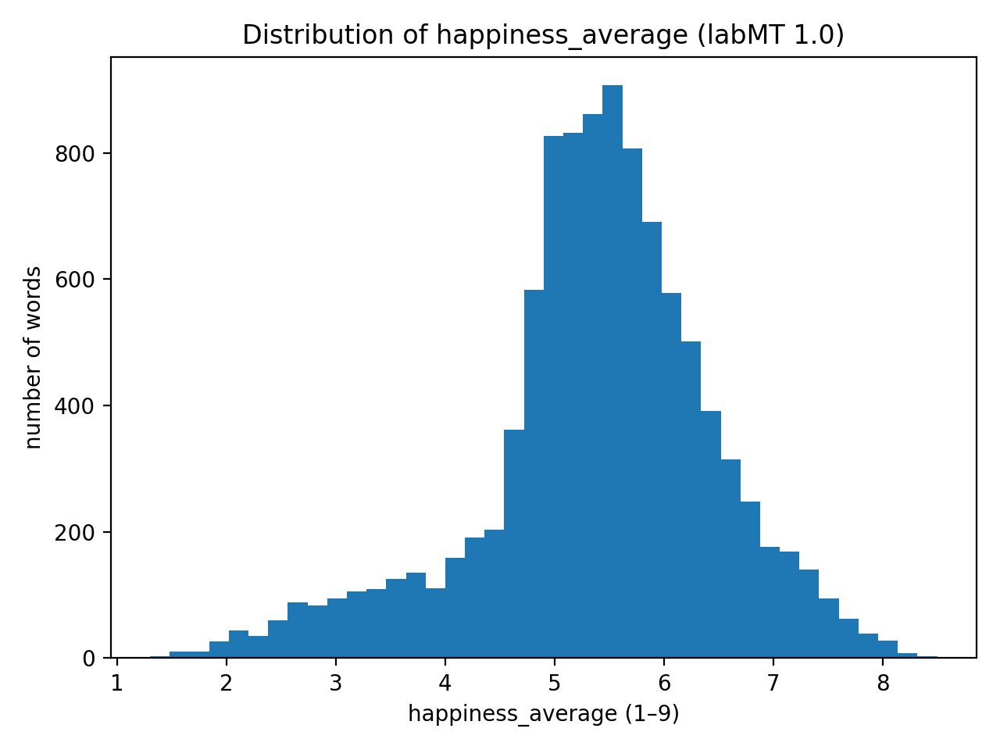
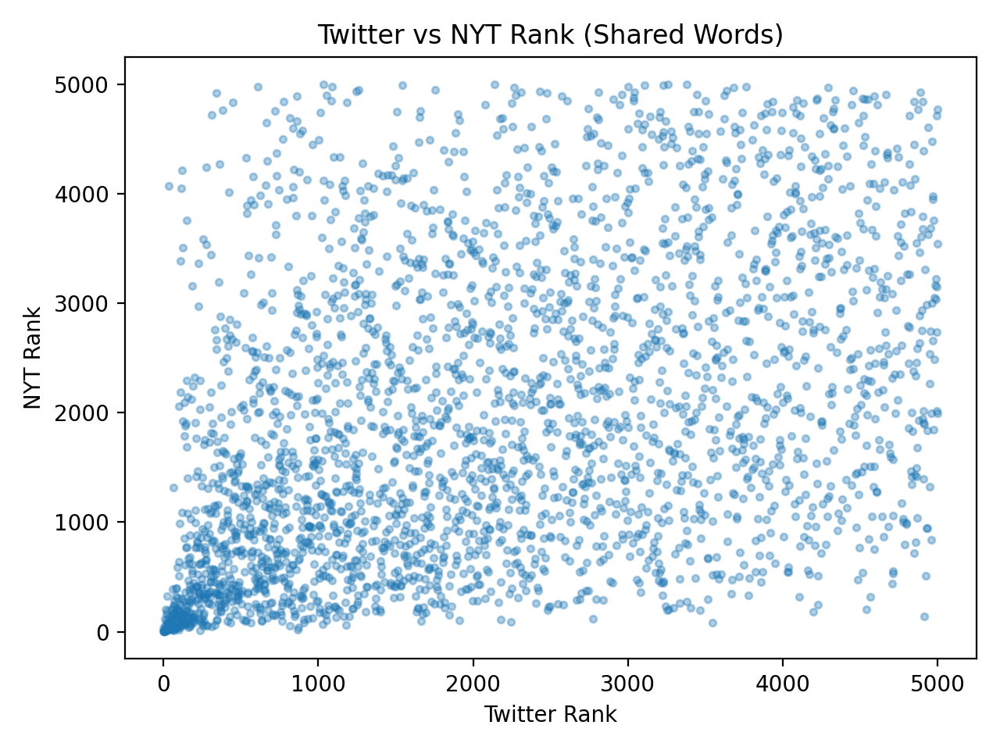

# labMT Hedonometer Dataset Analysis

## Project Overview

This project analyzes the labMT 1.0 dataset, which contains happiness scores for 10,222 English words rated by Amazon Mechanical Turk workers. The dataset enables measurement of emotional valence in large-scale texts across four different corpora: Twitter, Google Books, NY Times, and song lyrics. Our analysis combines quantitative exploration (distributions, disagreements, corpus overlaps) with qualitative interpretation of selected words to understand how emotional meaning varies across contexts and communities.

## Dataset

- Source

The dataset comes from Dodds et al. (2011) "Temporal Patterns of Happiness and Information in a Global Social Network:  Hedonometrics and Twitter," published in PLOS ONE. It was constructed by collecting frequency rankings from four corpora and crowdsourcing happiness ratings for each word via Amazon Mechanical Turk.

- Data Dictionary

We created a data dictionary to summarize each column's content, type, and missing values.

| Column                      | Type    | Missing Values | Description                              |
|----------------------------| ---------|----------------|------------------------------------------|
| word                        | str     | 0              | Word being assessed                      |
| happiness_rank              | int64   | 0              | Rank based on happiness (1 = happiest)   |
| happiness_average           | float64 | 0              | Average happiness score (1-9)            |
| happiness_standard_deviation| float64 | 0              | Standard deviation of happiness          |
| twitter_rank                | float64 | 5222           | Twitter rank of the word                 |
| google_rank                 | float64 | 5222           | Google Books rank of the word            |
| nyt_rank                    | float64 | 5222           | New York Times rank of the word          |
| lyrics_rank                 | float64 | 5222           | Lyrics rank of the word                  |

> Missing ranks (`NaN`) indicate that the word does not appear in that corpus's top 5,000 most frequent words.

## Methods

We performed the following analyses using Python with pandas, matplotlib, and numpy:

1. **Data Loading and Cleaning**

 - 1.1 Load the File

We loaded the labMT 1.0 dataset using pandas `read_csv`. The dataset is tab-delimited and contains three lines of metadata at the top, which we skipped using `skiprows=3`. We also treated '--' as missing values (`NaN`) using `na_values="--"`.

The dataset contains 10222 rows and 8 columns.  

A missing rank (`--`) indicates that the word does not appear in that particular corpus.

- 1.2 Data Dictionary (See "DataSet")

- 1.3 Sanity Checks

 We performed several sanity checks to ensure the dataset is clean and reasonable.

# Check for duplicated words:
 There are no duplicated words in the dataset, confirming unique entries for each word.

# Random sample of 15 rows:
 We inspected a random subset of 15 rows to verify that values appear consistent and correct. Example sample:

| word        | happiness_rank | happiness_average | ... | lyrics_rank |
|------------|----------------|-----------------|-----|------------|
| prom       | 2883           | 5.94            | ... | NaN        |
| on         | 4515           | 5.56            | ... | 14.0       |
| mis        | 7718           | 4.88            | ... | 1292.0     |
| friendship | 34             | 7.96            | ... | 3980.0     |
| naval      | 4925           | 5.48            | ... | NaN        |
| grand      | 533            | 7.06            | ... | 1575.0     |
| wen        | 8029           | 4.80            | ... | NaN        |
| extract    | 5861           | 5.28            | ... | NaN        |
| harry      | 6055           | 5.24            | ... | NaN        |
| designers  | 1544           | 6.38            | ... | NaN        |
| external   | 4895           | 5.48            | ... | NaN        |
| screwed    | 9685           | 3.24            | ... | 4908.0     |
| pittsburgh | 6533           | 5.14            | ... | NaN        |
| vital      | 3609           | 5.76            | ... | NaN        |
| obedience  | 5327           | 5.40            | ... | NaN        |

# Top 10 positive words:
The words with the highest happiness scores are logical and correspond to highly positive terms. 

| word      |happiness_average|
|-----------|-----------------|
| laughter  | 8.50            |
| happiness | 8.44            |
| love      | 8.42            |
| happy     | 8.30            |
| laughed   | 8.26            |
| laugh     | 8.22            |
| laughing  | 8.20            |
| excellent | 8.18            |
| laughs    | 8.18            |
| joy       | 8.16            |

# Top 10 negative words:
The words with the lowest happiness scores correspond to negative or sensitive terms.

| word       | happiness_average |
|-----------|-----------------|
| suicide   | 1.30            |
| terrorist | 1.30            |
| rape      | 1.44            |
| murder    | 1.48            |
| terrorism | 1.48            |
| cancer    | 1.54            |
| death     | 1.54            |
| died      | 1.56            |
| kill      | 1.56            |
| killed    | 1.56            |

> These checks confirm that the happiness scores and words are reasonable, and no data entry errors are apparent.

## Results

2. **Quantitative exploration: distributions and relationships**

### 2.1 Distribution of Happiness Scores



Summary Statistics:
- Mean: 5.38
- Median: 5.44
- Standard Deviation: 1.08
- 5th Percentile: 3.18
- 95th Percentile: 7.08

The distribution of happiness scores is centered slightly above 5, with mean and median very close (5.38 and 5.44), indicating approximate symmetry. Most words fall between 4 and 6.5, suggesting that everyday English vocabulary leans mildly positive. Extremely positive and extremely negative words are relatively rare, with only 5% of words scoring below 3.18 and 5% scoring above 7.08. This pattern suggests that common language tends toward moderate positivity, with strong emotional words occupying the tails of the distribution. One interesting pattern is that strongly negative words (very low scores) are much less common than neutral or slightly positive words. This suggests that common language tends to lean slightly positive overall.

### 2.2 Disagreement: Words with High Standard Deviation

We used happiness_standard_deviation to measure how much people disagreed when rating each word.


We plotted a scatterplot with:
happiness_average on the x-axis
happiness_standard_deviation on the y-axis

Most words cluster in the middle of the plot. Their average happiness lies between roughly 4 and 7, and their standard deviation is around 1.0. This indicates that for the majority of words, annotators broadly agree on whether the word feels positive, neutral, or negative. In contrast, a small group of words have very high standard deviations (above ~2.4). These “contested” words are those where annotators’ ratings strongly disagree.

Five examples include:
1. fucking / fuck / fuckin / fucked
These are very frequent swear words in contemporary English. They can signal strong negative emotion (“fucking awful”), but also serve as intensifiers in positive or humorous contexts (“that was fucking amazing”). Some annotators may rate them as very negative because of their taboo/insulting usage, while others may focus on their role as casual emphasis and assign more neutral or even mildly positive ratings. This mixture of offensiveness and playful emphasis likely produces the very high standard deviations we see.

2. whiskey (5.72, 2.64)
On the surface, “whiskey” is a relatively neutral object word. However, it is associated both with positive contexts (celebration, relaxation, craft culture) and negative ones (addiction, hangovers, self-destructive behavior). People who associate it with convivial, social drinking might rate it as positive, while others who associate it with alcoholism or “drinking to cope” might rate it as negative. This ambivalence around alcohol fits its high standard deviation.

3. churches (5.70, 2.46)
“Churches” has an average happiness slightly above 5, but a very large standard deviation. For some annotators, churches may evoke community, comfort, and spirituality; for others, they may evoke hypocrisy, exclusion, or painful personal experiences. Because religion is a deeply personal and culturally contingent topic, it makes sense that the emotional charge of “churches” varies widely across raters.

4. capitalism (5.16, 2.45)
“Capitalism” sits near the middle in average happiness, but with large disagreement. This reflects contemporary political and ideological divisions. Some annotators may view capitalism as synonymous with opportunity, innovation, and freedom. However, others may associate it with inequality, exploitation, and crisis. The word is strongly politicized, so we should expect its emotional valence to differ substantially across individuals.

5. pussy (4.80, 2.67)
This word is highly polysemous and gendered. It can be used as an insult (especially towards men, implying weakness), as a sexual term, and in some contexts as a reclaimed or playful expression. Different annotators may respond to different senses and social norms around sexism and sexuality, leading to wide disagreement in how “happy” or “unhappy” the word feels.

Overall, these words may be contested because:

- They can have multiple meanings (ambiguity)
- Their emotional tone depends on context
- Some may function as slang
- Some may carry irony or mixed connotations

The quantitative pattern (high standard deviation) reflects qualitative ambiguity: words that allow multiple interpretations naturally produce more disagreement among raters. In this sense, standard deviation does not merely capture rating noise; it indexes cultural contestation and semantic instability.

### 2.3 Corpus comparison: rank coverage and overlaps

We created a heatmap to present the overlaps between corpora

This is a heatmap-like overlap matrix. Diagonal cells are 5000 by construction (top-5000 size). Off-diagonal cells show how many words appear in both corpora’s top-5000 lists.

The corpora share a substantial “core vocabulary,” but overlaps vary a lot depending on the pair:
•	NYT ∩ Google Books is relatively high (3414) → both are more formal/edited writing, so their frequent vocabulary overlaps more.
•	NYT ∩ Lyrics is relatively low (2241) → lyrics include more colloquial, stylized, and genre-specific vocabulary that doesn’t appear as often in newspaper prose.
•	Twitter overlaps strongly with Lyrics (3127) → both contexts are more conversational and informal, so they share more common slang / everyday terms.

We also created a Scatterplot of Twitter rank vs NYT rank for words that appear in both corpora. Lower rank means more frequent.


If the same words were similarly “common” across corpora, points would cluster near a diagonal trend. Instead, the plot shows wide spread: many words are very common in Twitter but not in NYT (and vice versa). That suggests “common language” is not an absolute property of a word—it is contextual, shaped by genre, platform norms, and institutional style (e.g., conversational talk vs editorial writing).

Concrete example of corpus-specific difference: “capitalism.”
It appears in Twitter and NYT but is much less prominent in Lyrics. This reflects communicative differences:
	•	Twitter and NYT contain political and institutional discourse.
	•	Lyrics foreground personal emotion, identity, and narrative voice rather than institutional vocabulary.
Similarly, slang or profanity terms (e.g., “fucking”) tend to appear in Twitter and Lyrics but are less common in formal corpora like Google Books, reflecting editorial filtering and stylistic norms.

# Qualitative “exhibit” of words

3. **Qualitative exploration: close reading the lexicon as a cultural artifact**

- 3.1 Build a small “exhibit” of words


### Critical Reflection

- 4.1 Reconstruct the pipeline (data provenance)

The labMT 1.0 dataset was constructed through a multi-stage process that transformed raw text collections into the numerical happiness scores we've been analyzing. Based on Dodds et al. (2011) and our examination of the data structure, here is the reconstruction of how this dataset came to be:

# Step 1: Corpus Selection and Word Extraction

The researchers first assembled four distinct text corpora representing different domains of language use:

| Corpus | Source | Language Type |
|--------|--------|---------------|
| Twitter| 4.6 billion tweets (2008-2010) | Social media, informal, conversational |
| Google Books| Millions of digitized books | Formal, literary, academic, diverse genres |
| New York Times| 1.8 million articles (1987-2007) | Journalism, news reporting, formal prose |
| Lyrics| Song lyrics from various genres | Poetic, emotional, rhythmic language |

From each corpus, they extracted word frequency lists, counting how many times each word appeared. This produced four separate ranked lists showing the most common words in each text domain.

# Step 2: Creating the Master Word List

The researchers then compiled a master list of words to be rated. This wasn't simply all words from all corpora. Instead, they needed a manageable set that represented common English vocabulary. The final list contains 10,222 words, selected based on:
  - Appearing sufficiently often across multiple corpora
  - Covering a range of frequencies (from very common to moderately rare)
  - Including words with linguistic and cultural interest

This is why each corpus column has exactly 5,000 non-missing values. As each corpus contributed its top 5,000 most frequent words to the master list.

# Step 3: Happiness Rating Collection via Amazon Mechanical Turk

This is the most crucial step where raw text became emotional data. The researchers used Amazon's Mechanical Turk platform to crowdsource happiness ratings:
 - Raters: Each word was shown to 50 unique individuals (all US-based, English-speaking)
 - Task: Raters were asked "How happy does this word make you feel?"
 - Scale: 1 (sad) to 9 (happy) - a 9-point Likert scale
 - Process: Words were presented in random order, one at a time, without context

The choice of 50 raters per word represents a balance between statistical reliability and cost. With fewer raters, individual biases would have too much influence; with more, the cost would become prohibitive.

# Step 4: Statistical Aggregation

For each word, the researchers calculated two key metrics from the 50 ratings:

| Metric | Formula | What It Tells Us |
|--------|---------|------------------|
| happiness_average | Mean of all 50 ratings | The central tendency of emotional response |
| happiness_standard_deviation| Standard deviation of ratings | How much people disagreed about the word |

The happiness_rank column (1 = happiest word) was then computed by sorting all words by their average happiness score. This rank is what gives the dataset its name. It's a "hedonometer" or happiness meter that can rank words by emotional valence.

# Step 5: Frequency Rank Integration

Finally, the researchers integrated the frequency information from the original corpora:
 - For each word, they recorded its frequency rank in each corpus (1 = most frequent)
 - If a word didn't appear in a corpus's top 5,000, it was marked as missing (`--` in the raw data, converted to `NaN` in our analysis)

This integration created the dataset structure we've been working with: one row per word, with columns for happiness metrics and four corpus-specific frequency ranks.

# Step 6: Data Publication

The resulting dataset was published as supplementary material alongside the 2011 paper "Temporal Patterns of Happiness and Information in a Global Social Network" in PLOS ONE. The dataset includes:
 - 10,222 words
 - 7 data columns (word, happiness_rank, happiness_average, happiness_standard_deviation, and four corpus ranks)
 - Tab-separated format with metadata headers

# What This Pipeline Reveals

This generation process explains several features we observed in our analysis:

1. Missing ranks occur because a word wasn't frequent enough in a particular corpus to make its top 5000 - not because the word doesn't exist in that domain.
2. Standard deviation measures genuine disagreement among raters, not ambiguity in the word itself (though these often correlate).
3. The 2011 time stamp means all ratings and frequency data reflect language use from approximately 2008-2010. Words like "tweet" (rank 107 on Twitter, missing from NYT) had different meanings then - Twitter was still新兴, and "tweet" primarily meant bird sounds to many people.
4. Cultural bias is baked in from the start - all raters were US-based English speakers, so the happiness scores reflect American emotional associations, not universal human response.

Overall, this pipeline transforms messy, context-dependent human language into clean numerical data. It is a powerful simplification, but one that comes with important limitations we'll explore in the next section.

- 4.2 Consequences and limitations

# Only high-frequency words (top 5000 per corpus)
Each source corpus only contributed its top 5,000 words by frequency. Words outside these frequency bands never enter labMT at all. The dataset focuses on mainstream, high-frequency vocabulary and largely ignores rare, technical, or niche words.
This makes it easier to measure the emotional tone of “ordinary” language across large corpora but makes it hard to analyze specialized domains (e.g., medical jargon, fandom slang, minority dialects). 

For example, every rank column (twitter_rank, google_rank, nyt_rank, lyrics_rank) has exactly 5,000 non-missing values, and together they cover about 48.9% of the lexicon per corpus. Our overlap analysis shows 327 words (3.2%) that appear in none of the four top-5000 lists. Tthese words are present in labMT (because they came from at least one corpus’s 5000 list before merging), but in practice we cannot tie them strongly to any particular corpus. If we wanted to study less frequent, emerging slang or technical terms, labMT would simply not “see” them.

# Rating words in isolation, without context
Mechanical Turk workers rated words alone, with no sentence or situational context. This makes the dataset easier to collect and apply (we only need word → score), but it ignores polysemy (multiple meanings) and contextual usage. Some words can be positive in one context and negative in another; rating them out of context collapses these into a single average, often hiding the underlying disagreement.

For example, we plotted happiness_average vs happiness_standard_deviation and found a set of highly “contested” words with very high standard deviation. Words like “fucking”, “pussy”, “whiskey”, “churches”, “capitalism” all have standard deviations above 2.4. “fucking” can be a hostile insult or an emphatic positive (“fucking amazing”); “pussy” mixes sexual and gendered insult meanings; “whiskey” can be associated with social drinking or addiction; “churches” and “capitalism” have strong ideological and personal connotations. The high disagreement indicates that different raters “saw” different senses of the same word—context that the dataset cannot capture.

# Using a single 1–9 “happiness” dimension
The labMT ratings reduce emotional response to a single valence dimension (1 = unhappy, 9 = happy), without measuring arousal (calm/excited), dominance (in control/overwhelmed), or more nuanced categories (e.g., nostalgia, irony). Therefore, the complex or mixed emotions are forced onto a single “happiness” line. Words that evoke ambivalent feelings (e.g., “whiskey”, “mortality”) may have mid-level averages that mask the fact that some people feel strongly positive and others strongly negative.

For example, “whiskey” has happiness_average ≈ 5.72 but happiness_standard_deviation ≈ 2.64, placing it among the most contested words. The mid-range average might tempt us to call it “neutral,” yet the high sd reveals polarized reactions.
A more multidimensional instrument could separate “pleasant excitement,” “guilty pleasure,” or “danger,” which are all collapsed here.

# Mechanical Turk as annotator population
All ratings come from workers on Amazon Mechanical Turk, primarily English-speaking internet users who opted into such tasks around 2010–2011.The emotional scores reflect the cultural and demographic biases of that annotator pool (likely overrepresenting certain countries, age groups, and internet-savvy populations).
Words tied to specific political or religious debates (e.g., “capitalism,” “churches”) will be colored by the prevailing attitudes of those workers, not by some abstract universal meaning.

For example, “churches” (avg ≈ 5.70, sd ≈ 2.46) and “capitalism” (avg ≈ 5.16, sd ≈ 2.45) show high disagreement.
These disagreements likely reflect differing personal experiences and political views among Turkers (e.g., religious vs secular, pro- vs anti-capitalist). If we applied labMT in a different cultural context (e.g., outside the U.S.), these scores might not generalize.

# Corpus selection (Twitter, Books, NYT, Lyrics) and genre bias
The lexicon is derived only from four English-language corpora. The dataset is heavily tuned to written English in particular genres, including conversational social media; published books; mainstream news and popular music. It under-represents spoken, non-digital, non-English, and non-mainstream communities. What labMT treats as “common” vocabulary is really “common in these four specific genres.”

For example, our overlap matrix shows that Google Books & NY Times are the most similar pair (3,414 words in common; 33.4% of the lexicon), while NY Times & Lyrics are the least similar (2,241 words; 21.9%). Words like rt, lol, haha, gonna, wanna are highly frequent on Twitter but do not appear in the NYT top-5000 at all. Conversely, NYT and Google Books likely share more formal, topic-specific words that are rare on Twitter or in lyrics. This means labMT is excellent for measuring sentiment in these four genres, but might miss important vocabulary in, say, scientific forums, gaming chat, or multilingual communities.

# Time-bound snapshot of language
The corpora and ratings reflect language usage around 2008–2011. The lexicon and ratings do not automatically update as language evolves. New slang, memes, and shifting connotations (e.g., of political terms) are not captured.

For example, words like rt, lol, blog appear as very frequent on Twitter in our 2011-era rankings. More recent slang (e.g., “yeet”, “stan”) is absent from labMT entirely. If we used labMT today without updating it, we would mis-measure or ignore large parts of current online language.

- 4.3 If you were to use this dataset as an instrument today…

The LabMT dataset is best understood as a lexical affect instrument rather than a measure of lived emotional experience. We would trust it to approximate large-scale trends in average lexical valence across corpora, especially when analyzing aggregate shifts in tone (e.g., comparing overall positivity in news versus song lyrics). Because it is standardized and reproducible, it works well for macro-level comparisons and computational modeling of sentiment trends.

However, we would refuse to claim that it captures “true emotion” or contextual meaning. The dataset assigns a single scalar value to words presented in isolation, ignoring irony, sarcasm, genre, identity, and pragmatic use. Our disagreement analysis showed that words such as fucking, whiskey, and capitalism produce high standard deviation scores, indicating that affect depends heavily on interpretation. Therefore, LabMT should not be used to draw conclusions about speaker intention, community identity, or moral stance.

If we were to rebuild this instrument today, we would introduce three improvements. First, we would collect contextualized ratings (short sentence fragments rather than isolated words). Second, we would diversify the rater pool across regions and sociolinguistic backgrounds to reduce cultural bias. Third, we would move beyond a single “happiness” dimension toward a multidimensional affect model (e.g., valence, arousal, dominance). These changes would make the dataset more sensitive to ambiguity and social context while retaining its usefulness for large-scale analysis.


### How to Run the Code

# Structure latout 

 - `src/` — Python analysis scripts for raw Data_Set_1.txt
 - `data/raw/` — input data (Data_Set_1.txt)
 - `figures/` — PNG plots
 - `tables/` — CSV tables/summaries
 - README.md (graded) 
 - requirements.txt


# Setup Steps 

 1. Clone the repository
git clone https://github.com/your-username/labMT-hedonometer-project.git
cd labMT-hedonometer-project

 2. Create and activate virtual environment
python -m venv .venv
source .venv/bin/activate  # On Mac/Linux
or .venv\Scripts\activate  # On Windows

 3. Install dependencies
pip install -r requirements.txt

 4. Run the analysis
python3 src/data_analysis.py

 5. What gets generated?
After running, look in:
- `figures/` — PNG plots
- `tables/` — CSV summary tables

### Credits

# Team roles:
1. Repo & workflow lead
2. Data wrangler
3. Quantitative analyst
4. Qualitative / close-reading lead
5. Provenance & critique lead
6. Editor & figure curator

# Citation of papers:
Dodds, Peter Sheridan, Kameron Decker Harris, Isabel M. Kloumann, Catherine A. Bliss, and Christopher M. Danforth. 2011. “Temporal Patterns of Happiness and Information in a Global Social Network: Hedonometrics and Twitter.” Edited by Johan Bollen. PLoS ONE 6 (12): e26752. https://doi.org/10.1371/journal.pone.0026752.

## Academic integrity & AI note


### 2.3 Corpus comparison: rank coverage and overlaps
- Data Overview
The analysis examines how many of the 10,222 labMT words appear in the top-5000 word lists of four different corpora: Twitter, Google Books, NY Times, and Lyrics.

- Corpus Coverage
Each corpus contains exactly 5,000 words (48.9% of the total labMT vocabulary). This is by design, as each corpus provides only its top-5000 most frequent words.

- Corpus overlaps
The heatmap shows varying degrees of similarity between corpora:
1. Formal and Informal Divide: Google Books and NY Times cluster together (high overlap), while Twitter stands apart with unique vocabulary.

2. Emotional Expression: Lyrics share more with Twitter (informal) than with formal corpora.

3. Core Vocabulary: Only 1,816 words (17.8%) appear in all four corpora. These are the most universal English words.

4. Specialized Vocabulary: 327 words (3.2%) appear in none of the corpora, representing rare or highly specialized terms.

- Concrete Example: "lol"

Where it appears:
Twitter: Rank 42 (very common)
Google Books: Missing from top 5000
NY Times: Missing from top 5000
Lyrics: Missing from top 5000

Interpretation:
The word "lol" (laughing out loud) is extremely common on Twitter but absent from the top 5000 words of Google Books, NY Times, and Lyrics. This difference reveals several important factors:
1. Register and Formality: "lol" is an informal acronym born from internet chat culture. It is appropriate for casual social media but would be out of place in formal writing like books or newspapers. An author would never write "The president announced the policy, lol" in a serious article.

2. Temporal Context: The data from 2011 captures "lol" at a time when it was still primarily an internet/texting phenomenon. It had not yet been adopted into broader usage to the same degree as today.

3. Genre Conventions: Song lyrics rarely use internet acronyms like "lol" because they date the material and may not fit the emotional tone of songs. Even in informal music genres, complete words are preferred over text-speak abbreviations.

4. Audience Expectations: Twitter's audience expects and accepts informal, abbreviated language. NY Times readers expect formal, standard English. This word choice reflects how writers adapt their language to different audiences and contexts.

This example perfectly illustrates how the same word can thrive in one linguistic environment while being completely absent from another - a testament to the rich variation in how English is used across different domains.

### 3.1 Build a small “exhibit” of words

Based on our quantitative analysis, we selected 20 words across four categories for close reading and interpretation. This qualitative examination reveals how context, community, and cultural factors influence the emotional valence of words.

- Very Positive Words: laughter, happiness, love, happy, laughed

These words consistently score above 8.2 on the happiness scale, indicating strong cross-cultural consensus about their positive emotional content. "Love" and "happiness" represent fundamental human emotions that are universally valued across communities. Interestingly, variations of "laugh" (laughter, laughed) all score highly, suggesting that actions associated with joy are consistently rated as positive regardless of grammatical form. These words are used similarly across all contexts from formal literature to social media. This may because they describe core human experiences that transcend register differences. Their high scores reflect genuine emotional responses rather than contextual ambiguity.

- Very Negative Words: suicide, terrorist, rape, murder, terrorism

With scores below 1.5, these words represent the darkest aspects of human experience. What's striking is that these words have relatively low standard deviations (0.78-1.01), meaning people overwhelmingly agree on their negative valence. This consensus reflects societal taboos and shared understanding of trauma. "Terrorist" and "terrorism" (both 1.30/1.48) are particularly interesting as they represent politically charged concepts that might theoretically be viewed differently across communities, yet the ratings show remarkable agreement about their negative emotional impact. This suggests that regardless of political orientation, people recognize these words as describing fundamentally harmful actions.

- Highly Contested Words: fucking, fuckin, fucked, pussy, whiskey

These words have the highest standard deviations (2.4-2.9), revealing significant disagreement about their emotional valence. The profanity cluster (fucking, fuckin, fucked) demonstrates how context dramatically alters meaning. In some communities, these function as intensifiers with little emotional content ("that's fucking awesome"), while in others they retain their taboo status. "Whiskey" (5.72 average, 2.64 st dev) is particularly fascinating. It can represent celebration and sociability in some contexts, addiction and despair in others. These words show that happiness scores cannot capture contextual nuance. The same word can evoke warmth in a toast or sorrow in a story about alcoholism. Different age groups, social classes, and cultural backgrounds likely rate these words very differently based on personal experience.

- Culturally Loaded Words: rt, lol, im, twitter, haha

These words all common on Twitter but absent from NYT's top 5000, reflect the emergence of internet-mediated language. "rt" (retweet) and "lol" (laughing out loud) are platform-specific conventions that would be meaningless to readers of traditional newspapers. Their happiness scores vary widely. For example, "haha" scores 7.64, capturing genuine amusement, while "rt" scores only 4.88 as a purely functional term. These words reveal how new communities (social media users) develop vocabulary that serves their specific communicative needs. A journalist would never write "lol" in a news article, but for Twitter users it's essential punctuation for digital conversation. The absence of these words from formal corpora doesn't make them "incorrect" English. It makes them register-specific, showing how language adapts to different platforms and purposes.

- High-Rank Surprises: love, happy, old
This category reveals words that are extremely common (ranked in top 100 of at least one corpus) but have unexpected happiness scores - either surprisingly high or surprisingly low for such frequent words.

1. love (Twitter rank: 25, happiness: 8.42) and happy (Twitter rank: 65, happiness: 8.30) appear exactly where we might expect. They are both very common and very positive. Their inclusion here actually reinforces their status as core emotional vocabulary that appears frequently because people talk about these feelings often.

2. old (Twitter rank: 212, Google rank: 152, happiness: 3.98) is truelly surprisingly. This word appears in the top 200 of both Twitter and Google Books, making it extremely common across both informal and formal contexts. Yet its happiness score of 3.98 places it well below the median of 5.44. The frequent word score of it is quite low may because
"old" often pairs with negative concepts, such as "old and tired," "too old," "feeling old," "old age problems." While it can be neutral or even positive in some contexts including "old friend" and "old wisdom", the dominant cultural narrative around aging in many societies skews negative. This word demonstrates that frequency doesn't guarantee positivity. Common words can carry subtle but consistent negative valence. It also shows how a single word can accumulate negative connotations through the company it keeps, such as collocations like "old and frail," "old and useless".

- Conclusion
This exhibit demonstrates that word happiness cannot be understood in isolation. Very positive and negative words show consensus because they reference universal human experiences. Contested words reveal the limits of averaging. A single number cannot capture the context-dependent nature of emotional language. Platform-specific words remind us that vocabulary choice signals community membership. The high-rank surprises category reveals that even our most common words carry complex emotional baggage shaped by cultural narratives and collocational patterns. Overall, these 25 words tell a story about how meaning is negotiated across different contexts, communities, and communicative situations.


Each corpus contributes exactly 5,000 words (its top 5,000 most frequent terms) to the labMT vocabulary.

**Corpus Overlap Heatmap:**


**Overlap Matrix (word counts):**

| | Twitter | Google Books | NY Times | Lyrics |
|---|--------|--------------|----------|--------|
| **Twitter** | 5,000 | 2,696 | 2,881 | 3,127 |
| **Google Books** | 2,696 | 5,000 | 3,414 | 2,368 |
| **NY Times** | 2,881 | 3,414 | 5,000 | 2,241 |
| **Lyrics** | 3,127 | 2,368 | 2,241 | 5,000 |

**Corpus Pair Similarity (sorted):**

| Pair | Shared Words | Percentage |
|------|--------------|------------|
| Google Books & NY Times | 3,414 | 33.4% |
| Twitter & Lyrics | 3,127 | 30.6% |
| Twitter & NY Times | 2,881 | 28.2% |
| Twitter & Google Books | 2,696 | 26.4% |
| Google Books & Lyrics | 2,368 | 23.2% |
| NY Times & Lyrics | 2,241 | 21.9% |

**Key Findings:**
- **Most similar pair**: Google Books and NY Times (33.4% overlap) - both represent formal, written language
- **Least similar pair**: NY Times and Lyrics (21.9% overlap) - formal journalism vs. poetic expression
- **Universal vocabulary**: Only 1,816 words (17.8%) appear in all four corpora
- **Specialized vocabulary**: 327 words (3.2%) appear in none of the corpora's top 5000

**Concrete Example: "lol"**

| Word | Twitter Rank | Google Books | NY Times | Lyrics |
|------|--------------|--------------|----------|--------|
| lol | 42 | Missing | Missing | Missing |

**Interpretation:**
The word "lol" (laughing out loud) is extremely common on Twitter (rank 42) but absent from all other corpora's top 5000. This difference reveals:

1. **Register and Formality**: "lol" is an informal internet acronym appropriate for casual social media but out of place in formal writing like books or newspapers.

2. **Temporal Context**: The 2011 data captures "lol" when it was still primarily an internet/texting phenomenon, before broader adoption.

3. **Genre Conventions**: Song lyrics rarely use internet acronyms as they may date material and not fit emotional tones.

4. **Audience Expectations**: Twitter audiences accept informal language; NY Times readers expect formal English.

This example illustrates how vocabulary choice reflects register, audience, and communicative purpose across different domains.

## Qualitative Exhibit: 25 Words for Close Reading

We selected 25 words across five categories for qualitative analysis, revealing how context, community, and culture influence emotional valence.

### Very Positive Words: laughter, happiness, love, happy, laughed

These words consistently score above 8.2, indicating strong cross-cultural consensus about their positive emotional content. "Love" and "happiness" represent fundamental human emotions universally valued across communities. Variations of "laugh" (laughter, laughed) all score highly, suggesting actions associated with joy are consistently rated as positive regardless of grammatical form. These words are used similarly across all contexts - from formal literature to social media - because they describe core human experiences that transcend register differences.

### Very Negative Words: suicide, terrorist, rape, murder, terrorism

With scores below 1.5, these words represent the darkest aspects of human experience. Their low standard deviations (0.78-1.01) show overwhelming agreement on their negative valence, reflecting societal taboos and shared understanding of trauma. "Terrorist" and "terrorism" are particularly interesting as politically charged concepts that might theoretically be viewed differently across communities, yet ratings show remarkable agreement about their negative emotional impact. This suggests that regardless of political orientation, people recognize these words as describing fundamentally harmful actions.

### Highly Contested Words: fucking, fuckin, fucked, pussy, whiskey

These words have the highest standard deviations (2.4-2.9), revealing significant disagreement about their emotional valence. The profanity cluster demonstrates how context dramatically alters meaning - functioning as intensifiers with little emotional content in some communities ("that's fucking awesome") while retaining taboo status in others. "Whiskey" (5.72 average, 2.64 st dev) is particularly fascinating, representing celebration and sociability in some contexts, addiction and despair in others. These words show that happiness scores cannot capture contextual nuance; the same word can evoke warmth in a toast or sorrow in a story about alcoholism.

### Culturally Loaded Words: rt, lol, im, twitter, haha

These words, common on Twitter but absent from NYT's top 5000, reflect the emergence of internet-mediated language. "rt" (retweet) and "lol" (laughing out loud) are platform-specific conventions meaningless to traditional newspaper readers. Their happiness scores vary widely - "haha" scores 7.64 capturing genuine amusement, while "rt" scores only 4.88 as a purely functional term. These words reveal how new communities develop vocabulary serving specific communicative needs. A journalist would never write "lol" in a news article, but for Twitter users it's essential punctuation for digital conversation.

### High-Rank Surprises: love, happy, old

This category reveals extremely common words (ranked in top 250 of at least one corpus) with unexpected happiness scores:

- **love** (Twitter rank: 25, happiness: 8.42) and **happy** (Twitter rank: 65, happiness: 8.30) appear where expected - very common and very positive, reinforcing their status as core emotional vocabulary.

- **old** (Twitter rank: 212, Google rank: 152, happiness: 3.98) is truly surprising. Despite appearing in the top 200 of both Twitter and Google Books, its happiness score (3.98) falls well below the median of 5.44. This low score likely reflects negative associations: "old" often pairs with concepts like "old and tired," "too old," "feeling old." While it can be neutral or positive in some contexts ("old friend," "old wisdom"), the dominant cultural narrative around aging skews negative. This demonstrates that frequency doesn't guarantee positivity - common words can carry subtle negative valence through the company they keep.

### Conclusion

This exhibit demonstrates that word happiness cannot be understood in isolation. Very positive and negative words show consensus because they reference universal human experiences. Contested words reveal the limits of averaging - a single number cannot capture context-dependent emotional language. Platform-specific words remind us that vocabulary choice signals community membership. High-rank surprises reveal that even our most common words carry complex emotional baggage shaped by cultural narratives and collocational patterns.

## Critical Reflection

### 4.1 Data Generation Pipeline

The labMT 1.0 dataset was constructed through a multi-stage process:

**Step 1: Corpus Selection and Word Extraction**
Researchers assembled four text corpora representing different language domains:
- **Twitter**: 4.6 billion tweets (2008-2010) - social media, informal
- **Google Books**: Millions of digitized books - formal, literary, academic
- **New York Times**: 1.8 million articles (1987-2007) - journalism, news
- **Lyrics**: Song lyrics - poetic, emotional, rhythmic

From each, they extracted word frequency lists, producing four ranked lists of most common words.

**Step 2: Creating the Master Word List**
They compiled a master list of 10,222 words representing common English vocabulary, selected based on appearing sufficiently across multiple corpora and covering a range of frequencies. Each corpus contributed its top 5,000 words, explaining why each rank column has exactly 5,000 non-missing values.

**Step 3: Happiness Rating Collection via Amazon Mechanical Turk**
Each word was shown to 50 unique US-based, English-speaking raters who answered: "How happy does this word make you feel?" on a 1 (sad) to 9 (happy) scale. Words were presented in random order, one at a time, without context.

**Step 4: Statistical Aggregation**
For each word, they calculated:
- **happiness_average**: Mean of all 50 ratings
- **happiness_standard_deviation**: Standard deviation of ratings
- **happiness_rank**: Ranking by average happiness score

**Step 5: Frequency Rank Integration**
They recorded each word's frequency rank in each corpus (1 = most frequent). Words not appearing in a corpus's top 5,000 were marked as missing (`--` in raw data, converted to `NaN` in our analysis).

**Step 6: Data Publication**
The dataset was published as supplementary material with Dodds et al. (2011) in PLOS ONE.

### 4.2 Consequences and Limitations

**Choice 1: Only high-frequency words (top 5000 per corpus)**
- **Consequence**: The dataset focuses on mainstream vocabulary, ignoring rare, technical, or niche words
- **What this makes harder to see**: Specialized domains (medical jargon, fandom slang, minority dialects)
- **Example**: 327 words (3.2%) appear in none of the four top-5000 lists; emerging slang like "yeet" or "stan" is entirely absent

**Choice 2: Rating words in isolation, without context**
- **Consequence**: Ignores polysemy and contextual usage; collapses multiple meanings into a single average
- **What this makes harder to see**: How the same word can be positive in one context and negative in another
- **Example**: "fucking" can be hostile insult or emphatic positive ("fucking amazing"); high standard deviation (2.93) reflects different raters "seeing" different senses

**Choice 3: Using a single 1-9 "happiness" dimension**
- **Consequence**: Reduces emotional response to one valence dimension, ignoring arousal, dominance, or nuanced categories
- **What this makes harder to see**: Complex or mixed emotions forced onto a single line
- **Example**: "whiskey" (avg 5.72, sd 2.64) appears mid-range but polarized responses (celebration vs. addiction) are collapsed

**Choice 4: Mechanical Turk as annotator population**
- **Consequence**: Scores reflect cultural and demographic biases of 2010-2011 US-based internet users
- **What this makes harder to see**: How different cultural contexts might rate words differently
- **Example**: "churches" (sd 2.46) and "capitalism" (sd 2.45) show high disagreement likely reflecting religious/secular and political divisions among Turkers

**Choice 5: Corpus selection and genre bias**
- **Consequence**: Lexicon tuned to written English in four specific genres
- **What this makes harder to see**: Spoken, non-digital, non-English, and non-mainstream communities
- **Example**: Words like "rt", "lol", "haha" are highly frequent on Twitter but absent from NYT top-5000

**Choice 6: Time-bound snapshot (2008-2011)**
- **Consequence**: Ratings and frequencies do not update as language evolves
- **What this makes harder to see**: New slang, memes, and shifting connotations
- **Example**: More recent slang (e.g., "yeet", "stan", "cringe" as adjective) is entirely absent

### 4.3 Using This Dataset Today

**What we would trust this dataset to measure:**
- Large-scale, aggregate measurements of emotional valence in English texts resembling its source corpora
- Comparing average emotional tone of large text collections over time
- Studying core, high-frequency vocabulary where annotators mostly agree (e.g., "laughter," "suicide")

**What we would refuse to claim:**
- Emotional states of individuals from their word usage
- Conclusions about rare words, new slang, or non-English language
- Universal judgments; scores reflect a specific annotator population and cultural moment
- Interpretations of mid-range averages for highly contested words without examining standard deviations

**Improvements if rebuilt today:**
1. Update and diversify corpora: Include newer sources (Reddit, forums, spoken transcripts) and multiple languages
2. Diversify and document annotators: Recruit balanced pool by region, age, language background; record metadata
3. Incorporate context: Rate words in common phrases and short sentences to handle negation and multiword meaning
4. Add emotional dimensions: Include arousal, dominance, or discrete categories (anger, fear, joy)

## How to Run the Code

- Structure latout 

 - `src/` — Python analysis scripts for raw Data_Set_1.txt
 - `data/raw/` — input data (Data_Set_1.txt)
 - `figures/` — PNG plots
 - `tables/` — CSV tables/summaries
 - README.md (graded) 
 - requirements.txt


- Setup Steps 

# 1. Clone the repository
git clone https://github.com/your-username/labMT-hedonometer-project.git
cd labMT-hedonometer-project

# 2. Create and activate virtual environment
python -m venv .venv
source .venv/bin/activate  # On Mac/Linux
or .venv\Scripts\activate  # On Windows

# 3. Install dependencies
pip install -r requirements.txt

# 4. Run the analysis
```bash
python3 src/run_analysis.py
```

# 5. What gets generated?
After running, look in:
- `figures/` — PNG plots
- `tables/` — CSV summary tables

## Credits

- Team roles:
1. Repo & workflow lead
2. Data wrangler
3. Quantitative analyst
4. Qualitative / close-reading lead
5. Provenance & critique lead
6. Editor & figure curator

- Citation of papers:
Dodds, Peter Sheridan, Kameron Decker Harris, Isabel M. Kloumann, Catherine A. Bliss, and Christopher M. Danforth. 2011. “Temporal Patterns of Happiness and Information in a Global Social Network: Hedonometrics and Twitter.” Edited by Johan Bollen. PLoS ONE 6 (12): e26752. https://doi.org/10.1371/journal.pone.0026752.

## Academic integrity & AI note