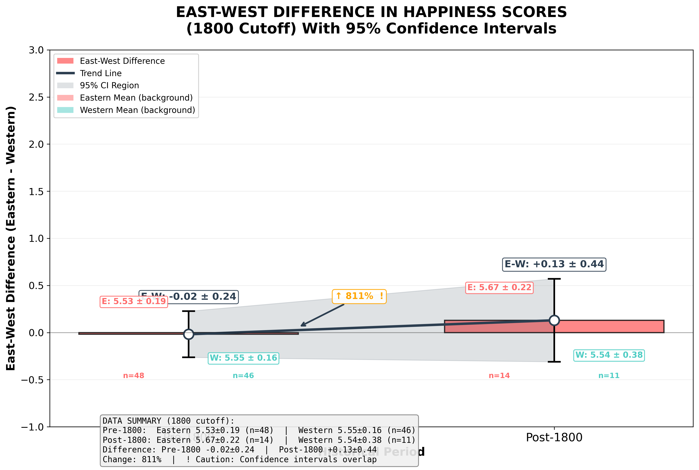

# Eastern vs. Western Aesthetic Concepts in Met Museum Artwork Titles: A Digital Humanities Study Applying the labMT Hedonometer

Summary: This project tests the cross-cultural validity of the labMT 1.0 hedonometer (built on American English) against 2000 years of artwork, from the Metropolitan Museum Of Art. The central finding shows no statistically significant difference in average happiness scores, however, the data shows that Eastern aesthetic concepts show greater emotional variability with a 35% wider range in scores. The lexical coverage analysis shows a systematic directional bias where cultural words like bodhisattva and mono are missing. LabMT 1.0 Hedonometer cannot read the emotions in Eastern traditions, which ignores the unique eastern linguistics.


## Project Overview

### Research Question

This project investigates how emotional language differs across cultural traditions by applying the labMT hedonometer to artwork titles from the Metropolitan Museum of Art. Our central research question asks: 

**How do happiness scores differ between Eastern and Western aesthetic concepts found in Met Museum artwork titles from the Pre-1800s to Post-1800s historical periods?** 

This question addresses a fundamental challenge, in which a general sentiment lexicon built from contemporary American English, can meaningfully capture emotional expression in culturally and historically diverse texts. In global digital heritage projects, researchers frequently apply computational tools developed in one cultural context to texts from another. This makes methodological transparency essential. We need to know whether instruments like the labMT hedonometer remain valid when they cross cultural boundaries. Our project directly tests this assumption.

### Relevance

Digital Humanities research often uses sentiment analysis without questioning whether how the tool itself works across different cultures and contexts. Our project asks a basic question: does a happiness lexicon built from American English actually capture how Eastern and Western art is described? By comparing scores across cultural traditions and historical periods, we show that the tool works differently for Eastern and Western titles. It is not because the art is different, but because the tool misses culturally specific words like "bodhisattva" and "wabi-sabi." This is important as computational tools are never neutral; they carry the assumptions and bias of the context they were built upon.

This finding speaks to a broader archival bias issue in digital humanities. Every computational tool is trained on a corpus that is influenced by cultural, historical, and linguistic elements. In this case, the labMT lexicon was built from English language texts, predominantly from Western sources. This tool enforces a Western emotional vocabulary as the universal standard, leaving out non-Western vocabulary. This is not merely a technical limitation, but a form of epistemic violence. By rendering culturally significant non-Western concepts illegible, it risks not being able to detect the vernacular differences that make cross-cultural study valuable. Acknowledging this not only demands revision of existing tools, but ensures that we must take this influence into account when interpreting our results. 

Our project thus contributes to ongoing DH conversations about algorithmic transparency and critical data studies. It demonstrates that sentiment analysis is never a neutral measurement, but a culturally situated practice. The tool does not reveal "universal" emotional content. It reflects what its training archive considers emotionally salient. By making this archive visible, we challenge the field to move beyond one-size-fits-all models and toward more culturally aware computational methods. This means building better dictionaries, but also questioning whether quantification is always the right approach. 

### Procedure

We hypothesized that Western aesthetic terms (such as "beauty," "sublime," and "glory") would cluster toward the positive end of the happiness scale, reflecting cultural emphasis on idealized forms and emotional clarity. In contrast, we expected Eastern concepts (like "zen," "wabi-sabi," and "impermanence") to show a greater range of scores, capturing the nuanced emotional palette of traditions that value transience, simplicity, and contemplative experience. We also hypothesized that these patterns might shift over time, with more recent artworks potentially showing greater convergence due to globalization or continued divergence due to persistent cultural differences.

Testing these hypotheses required us to first understand the instrument we were applying. Hence, our analysis of the labMT 1.0 dataset's distributional properties, disagreement patterns, and corpus overlaps before extending the methodology to artwork titles retrieved from the Met API using 24 aesthetic search terms (10 Western, 14 Eastern). We then introduced a temporal dimension using the `object_begin` metadata field, dividing the dataset into pre-1800 and post-1800 periods to examine whether the East-West happiness gap changes across historical eras and whether lexical coverage varies over time.

### Key Findings

#### Comparative Sentiment Analysis Metrics
| Metric | Eastern Aesthetic | Western Aesthetic | Result |
| --- | --- | --- | --- |
| Mean Score | 5.56 | 5.55 | No Significant Difference |
| Score Range | 4.10 points | 3.03 points | +35% Range in Eastern Art |
| High/Low Extremes | 7.92 / 3.82 | 6.86 / 3.83 | Eastern art is more emotionally varied |

Our central finding is that **Eastern and Western aesthetic concepts show no statistically significant difference in average happiness scores**. However Eastern titles exhibiting greater variability and capturing both the highest and lowest extreme values. The Eastern artworks scored marginally higher on average (5.56 vs. 5.55), but the difference is only 0.015 points. Both categories center around similar median values (Eastern 5.52, Western 5.49), confirming that the average difference is not driven by outliers. More interesting than the averages is the spread of scores. Eastern titles show greater variation (SD = 0.62 vs. 0.56), with a range of 4.10 points compared to Western's 3.03 points—a 35% wider range. The highest overall score (7.92) belongs to an Eastern artwork, as does the lowest (3.82), suggesting that Eastern aesthetic concepts encompass both more intensely positive and more intensely negative expressions than their Western counterparts. Western titles, by contrast, are more tightly clustered around the average, with no scores above 6.86 or below 3.83.

Furthermore, the **temporal analysis** reveals that the East - West difference remains small in both historical periods, with overlapping confidence intervals indicating no strong evidence of temporal change. In the pre-1800 subset, the estimated difference is close to zero (-0.02 [-0.20, 0.16]). In the post-1800 subset, it becomes slightly positive (0.12 [-0.12, 0.36]), though uncertainty is larger due to smaller sample size. **Lexical coverage analysis** shows that Western titles tend to have higher average coverage, with the gap more pronounced in pre-1800 artworks, suggesting that earlier Eastern titles contain more words falling outside the labMT lexicon.

More importantly, our analysis reveals that the labMT lexicon systematically misses culturally specific terminology (e.g., "bodhisattva," "wabi-sabi," "statuette," "verso"), raising fundamental questions about the instrument's cross-cultural validity. The coverage analysis shows that Eastern titles display slightly greater variability in lexical coverage, reflecting the presence of transliterated cultural concepts or non-English terms that do not appear in the hedonometer lexicon. Based on these findings, we offer critical reflections on the limitations of applying general purpose sentiment lexicons to specialized, cross-cultural texts and propose concrete recommendations for improving computational cultural analysis.

## Corpus and Data Acquisition

### The labMT Lexicon

The labMT 1.0 dataset comes from Dodds et al. (2011) and contains happiness scores for 10,222 English words rated by Amazon Mechanical Turk workers. Each word was rated by 50 unique individuals on a 1-9 scale, with the dataset including frequency ranks from four corpora: Twitter, Google Books, NY Times, and song lyrics. This lexicon serves as our measurement instrument, and understanding its properties is essential before applying it cross-culturally. 

The dataset contains 10222 rows and 8 columns:

| Column | Type | Missing | Description |
|--------|------|---------|-------------|
| word | str | 0 | Word being assessed |
| happiness_rank | int64 | 0 | Rank based on happiness (1 = happiest) |
| happiness_average | float64 | 0 | Average happiness score (1-9) |
| happiness_standard_deviation | float64 | 0 | Standard deviation of happiness |
| twitter_rank | float64 | 5222 | Twitter rank of the word |
| google_rank | float64 | 5222 | Google Books rank of the word |
| nyt_rank | float64 | 5222 | New York Times rank of the word |
| lyrics_rank | float64 | 5222 | Lyrics rank of the word |

> Missing ranks (`NaN`) indicate that the word does not appear in that corpus's top 5,000 most frequent words.

### The Met Museum Corpus

To test our research question, we collected artwork titles from the Metropolitan Museum of Art using their public API. We selected search terms representing Western and Eastern aesthetic concepts based on a review of aesthetic philosophy literature, though we recognize that these terms reflect Western academic frameworks for categorizing aesthetic concepts and may not map neatly onto how these traditions conceptualize aesthetic experience.

We used the [Metropolitan Museum of Art Collection API](https://metmuseum.github.io/) to search for artwork titles that contain aesthetic concepts from both Western and Eastern traditions.

**Search Terms:**

- **Western** (10 terms): beauty, sublime, pastoral, romantic, ideal, grace, glory, divine, harmony, splendor
- **Eastern** (14 terms): zen, ukiyo, wabi sabi, mono no aware, feng shui, simplicity, impermanence, emptiness, enlightenment, meditation, bamboo, cherry blossom, lotus, nirvana
  
The selection of search terms was guided by the principles of cultural representativeness, though we acknowledge the inherent challenges of applying Western academic frameworks to non-Western aesthetic traditions. For Western terms, we selected ten concepts central to Western aesthetic philosophy from the eighteenth century onward. These terms appear repeatedly in foundational texts (e.g., Burke, Kant) and art historical discourse, capturing the emotional and conceptual vocabulary through which Western art has been described. For Eastern terms, we faced a greater challenge, as many Eastern aesthetic concepts lack direct English equivalents. We selected fourteen terms that have gained recognition in Western art historical scholarship, acknowledging that this choice itself reflects a Western academic framing. These terms were chosen because they represent culturally distinct aesthetic values. For example, zen emphasizes spontaneous simplicity, wabi sabi embraces imperfection and transience, mono no aware captures the bittersweet awareness of impermanence.

We recognize that this selection carries inherent biases. The terms reflect Western academic categories for organizing non-Western aesthetics. A researcher from within these traditions might select different concepts entirely. Additionally, searching for these terms in an English-language API assumes that the English transliteration adequately captures the original concept—an assumption we treat with caution. The presence of these terms in the Met's English titles is itself a product of curatorial translation choices, not a reflection of how these concepts appear in their source cultures.

**Acquisition Pipeline:**
1. API search with `q={term}` and `hasImages=true` to ensure objects with images
2. Maximum 15 objects per term for balanced representation
3. Metadata retrieval (title, department, culture, period, artist)
4. Duplicate removal using `object_id` (same artwork may appear under multiple terms)
5. Rate limiting: 0.3-second delays between requests to respect API limits (80 requests/second)

**Raw data:** `data/raw/met_raw_data.csv`

**Date of access:** March 2026

**Ethics and Limitations**

- Only public artwork metadata was collected; no personal data
- The Met collection overrepresents Western art; non-Western cultures are underrepresented
- Only English titles are available; translations may lose cultural and emotional nuance
- Titles may be curatorial additions rather than artist-given
- The dataset represents the Met's collection and its curatorial framing, not a balanced sample of global art

**Dataset Characteristics**

After duplicate removal, the final dataset contains **132 unique artworks**:

- **Western aesthetic concepts**: 62 artworks
- **Eastern aesthetic concepts**: 70 artworks

Because the same artwork may appear under multiple search terms, duplicate objects were removed using the `object_id` field before analysis (double-checked).

**Population Context**

This dataset consists of artworks from the Metropolitan Museum of Art's collection that were retrieved using search terms related to Eastern and Western aesthetic concepts. The dataset represents artworks in the Met's collection that contain specific aesthetic keywords in their English-language titles, as provided by the museum, offering a snapshot of how one major Western institution catalogues and presents art from different cultural traditions. However, given above limitations, our analysis cannot make strong claims about the original artists' intent, how people from those cultures actually experience the art, or the full diversity of Eastern or Western aesthetic traditions more broadly. The dataset represents the Met's collection and its curatorial framing, not a balanced sample of global art.

**Data Dictionary**

| Column | Type | Description | Missing |
|--------|------|-------------|---------|
| object_id | int64 | Unique Met object identifier | 0.0% |
| title | object | Artwork title | 0.0% |
| category | object | Eastern or Western | 0.0% |
| culture | object | Cultural attribution | 57.6% |
| object_begin | int64 | Year (machine-readable) | 0.0% |
| score | float64 | Happiness score (1-9) from labMT | 9.8% |
| coverage | float64 | matched / total words | 0.0% |

From the Met Museum corpus, we rely on several key variables. `category` (Eastern or Western) serves as the primary variable for cultural comparison, assigned based on the search term used to retrieve each artwork. `object_begin` provides a machine readable start date, which we use to group artworks into Pre-1800 and Post-1800 periods for temporal analysis. `score` is the happiness score computed for each artwork title by averaging the `happiness_average` values of all words successfully matched to the labMT lexicon. Finally, `coverage` measures the proportion of title words matched to labMT, serving as a diagnostic metric to assess measurement reliability across cultural categories. In addition to supporting chronological description, the `object_begin` field was also used as a temporal variable in the supplementary analysis. We grouped artworks into two broad historical periods using a 1800 cutoff (`Pre-1800` vs. `Post-1800`) for additional comparisons of happiness scores and lexical coverage over time.

## Measurement and Operationalization

### Understanding the Instrument: labMT Analysis

Before applying the hedonometer to our Met corpus, we analyzed the labMT 1.0 dataset to understand what the instrument measures and where its limitations lie. We loaded the data using pandas `read_csv` with `skiprows=3` to bypass metadata lines and `na_values="--"` to treat '--' as missing values (`NaN`). Basic sanity checks confirmed no duplicate words to ensure data quality. 

The processed dataset `labMT_cleaned.csv` (with cleaned happiness scores) and the plots below can be generated by running `data_analysis.py`.

**Distribution of Happiness Scores**


The distribution of happiness scores is centered slightly above 5, with mean and median very close (5.38 and 5.44), indicating approximate symmetry. Most words fall between 4.5 and 6.5, suggesting that everyday English vocabulary leans mildly positive. Extremely positive and extremely negative words are relatively rare, with only 5% of words scoring below 3.18 and 5% scoring above 7.08. This pattern suggests that common language tends toward moderate positivity, with strong emotional words occupying the tails of the distribution.

An interesting pattern the distribution reveals is that the negative tail (scores below 3.18) is slightly longer than the positive tail (scores above 7.08). The negative tail extends from 1 to 3.18, spanning 2.18 points, while the positive tail extends from 7.08 to 9, spanning only 1.92 points. This means that when words do deviate from the neutral range, they are slightly more likely to be negative than positive. However, the overall mass of the distribution sits in the 5–6 range, indicating that everyday language maintains a mild positivity bias.

The extremes tell a different story. The most positive word,"laughter" (8.50) lies 3.12 points above the mean, while the most negative word "suicide" (1.30) lies 4.08 points below the mean. This indicates that although there are more mildly negative words, the most intensely negative word reaches further from neutrality than the most intensely positive word. In other words, the negative tail is longer, but its extreme endpoint is also more extreme.

Overall, these patterns suggest that English vocabulary is structured with a broad spectrum of mild negativity, but the single most emotionally intense word is negative. The strongly negative words (very low scores) are much less common than neutral or slightly positive words, confirming that common language tends to lean slightly positive overall.

**Disagreement Analysis**

We used happiness_standard_deviation to measure how much people disagreed when rating each word.


Most words cluster in the middle of the plot. Their average happiness lies between roughly 4 and 7, and their standard deviation is around 1.0. This indicates that for the majority of words, annotators broadly agree on whether the word feels positive, neutral, or negative. In contrast, a small group of words have very high standard deviations (above 2.4). These “contested” words are those where annotators’ ratings strongly disagree.

Five examples include:
1. fucking / fuck / fuckin / fucked
These are very frequent swear words in contemporary English. They can signal strong negative emotion (“fucking awful”), but also serve as intensifiers in positive or humorous contexts (“that was fucking amazing”). Some annotators may rate them as very negative because of their taboo/insulting usage, while others may focus on their role as casual emphasis and assign more neutral or even mildly positive ratings. This mixture of offensiveness and playful emphasis likely produces the very high standard deviations we see.

2. whiskey (5.72, 2.64)
On the surface, “whiskey” is a relatively neutral object word. However, it is associated both with positive contexts (celebration, relaxation, craft culture) and negative ones (addiction, hangovers, self-destructive behavior). People who associate it with convivial, social drinking might rate it as positive, while others who associate it with alcoholism or “drinking to cope” might rate it as negative. This ambivalence around alcohol fits its high standard deviation.

3. churches (5.70, 2.46)
“Churches” has an average happiness slightly above 5, but a very large standard deviation. For some annotators, churches may evoke community, comfort, and spirituality; for others, they may evoke hypocrisy, exclusion, or painful personal experiences. Because religion is a deeply personal and culturally contingent topic, it makes sense that the emotional charge of “churches” varies widely across raters.

4. capitalism (5.16, 2.45)
“Capitalism” sits near the middle in average happiness, but with large disagreement. This reflects contemporary political and ideological divisions. Some annotators may view capitalism as synonymous with opportunity, innovation, and freedom. However, others may associate it with inequality, exploitation, and crisis. The word is strongly politicized, so we should expect its emotional valence to differ substantially across individuals.

5. pussy (4.80, 2.67)
This word is highly polysemous and gendered. It can be used as an insult (especially towards men, implying weakness), as a sexual term, and in some contexts as a reclaimed or playful expression. Different annotators may respond to different senses and social norms around sexism and sexuality, leading to wide disagreement in how “happy” or “unhappy” the word feels.

The quantitative pattern (high standard deviation) reflects qualitative ambiguity. Words that allow multiple interpretations naturally produce more disagreement among raters. In this sense, standard deviation does not merely capture rating noise, it indexes cultural contestation and semantic instability.

Beyond identifying individual contested words, the overall shape of the scatterplot also reveals an important structural pattern. The points form a V-shaped distribution centered around happiness scores near 5. Words with average scores close to the midpoint (around 5) tend to have lower standard deviations, meaning that annotators largely agree that these words are emotionally neutral or only mildly positive or negative.

In contrast, words with more extreme average scores (very positive or very negative) tend to show greater horizontal spread and higher standard deviations. This occurs because emotionally charged words often evoke multiple interpretations depending on context, personal experience, or cultural background. For example, strongly negative words may be interpreted either literally (e.g., violence or suffering) or metaphorically (e.g., dramatic emphasis), while highly positive words may carry ironic or sarcastic uses. As a result, the further a word’s average happiness moves away from the neutral midpoint, the more room there is for disagreement among raters. This produces the wider “petals” of the plot at the extremes. The visual pattern therefore suggests that emotional intensity is associated with interpretive variability: strongly valenced words are not only emotionally charged but also socially and contextually contested.

**Corpus Comparison**

This is a heatmap-like overlap matrix. It shows the overlap between the top-5000 most frequent words in each corpus. Diagonal cells are 5000 by construction (each corpus contributes its top-5000 words), while off-diagonal cells indicate how many words appear in both corpora’s lists.


The corpora share a substantial “core vocabulary,” but overlaps vary a lot depending on the pair:
•	NYT ∩ Google Books is relatively high (3414) → both are more formal/edited writing, so their frequent vocabulary overlaps more.
•	NYT ∩ Lyrics is relatively low (2241) → lyrics include more colloquial, stylized, and genre-specific vocabulary that doesn’t appear as often in newspaper prose.
•	Twitter overlaps strongly with Lyrics (3127) → both contexts are more conversational and informal, so they share more common slang / everyday terms.

Overall, the corpora share a substantial “core vocabulary,” but the overlaps vary significantly depending on the pair. The highest overlap occurs between NY Times and Google Books (3414 words). This is expected because both corpora primarily consist of edited, formal written English. Newspapers and books share stylistic conventions such as standardized grammar, institutional topics (politics, economy, public life), and relatively conservative vocabulary. As a result, the most frequent words in these corpora tend to converge.

In contrast, NY Times and Lyrics show the lowest overlap (2241 words). This difference reflects not only the level of formality but also the communicative purpose of the texts. News writing prioritizes informational clarity and institutional discourse, while song lyrics emphasize emotion, rhythm, and personal expression. Lyrics therefore contain more figurative language, repetition, slang, and genre-specific vocabulary that rarely appears in journalistic prose.

Interestingly, Twitter overlaps more strongly with Lyrics (3127 words) than Lyrics does with NY Times. This pattern suggests that conversational and expressive forms of language share a common vocabulary across platforms. Both Twitter posts and song lyrics frequently include informal phrasing, everyday emotional language, and slang. However, this similarity may also reflect a methodological factor: both corpora capture more spontaneous or performative language, whereas the NY Times corpus reflects heavily edited institutional writing.

At the same time, these overlaps should be interpreted cautiously because they depend on how the corpora were constructed. Each dataset only includes the top-5000 most frequent words, which emphasizes common vocabulary and suppresses rare or specialized terms. As a result, the overlap matrix reflects similarities in high-frequency functional language rather than the full diversity of each corpus. In other words, the heatmap captures how everyday English circulates across genres, but it does not fully represent domain-specific or culturally distinctive vocabulary.

Concrete example of corpus-specific difference: “capitalism.”
It appears in Twitter and NYT but is much less prominent in Lyrics. This reflects communicative differences:
	•	Twitter and NYT contain political and institutional discourse.
	•	Lyrics foreground personal emotion, identity, and narrative voice rather than institutional vocabulary.
Similarly, slang or profanity terms (e.g., “fucking”) tend to appear in Twitter and Lyrics but are less common in formal corpora like Google Books, reflecting editorial filtering and stylistic norms.

**From Instrument to Application**

This analysis of the labMT lexicon reveals three key points that inform our application to the Met corpus:

- The instrument captures meaningful variation in emotional language, with a roughly symmetric distribution and interpretable disagreement patterns.
- The same word can have different frequencies and associations depending on context, which we must consider when interpreting titles from an art museum.
- The lexicon has culturally specific, religious, and artistic terminology (like those we will encounter in Eastern titles) may fall outside its scope, a limitation we track through coverage analysis.

With this understanding of what the hedonometer can and cannot measure, we now apply it to our corpus of Met artwork titles.

### Applying the Instrument: Scoring Met Titles

For each artwork title, we followed the standard hedonometer scoring procedure:

1. Break the title into individual words
2. Look up each word in the labMT dictionary
3. Take the average of all matched words

Simple Example: "love" (8.42) + "painting" (5.20) → (8.42 + 5.20) ÷ 2 = 6.81

**Tokenization**

Before scoring, we cleaned each title to make sure words would match the dictionary properly:

1. **Lowercase everything** – so "Love" and "love" match the same dictionary entry
2. **Remove punctuation** – commas, periods, and quotes are replaced with spaces
3. **Remove extra spaces** – so "  hello   world " becomes "hello world"
4. **Split into words** – using simple spaces as dividers

We kept every word that matched the labMT dictionary. No words were filtered out, even common ones like "the", "and", or "of" that have neutral scores around 5. If we had removed neutral words, Scores would be pulled toward extremes (higher highs, lower lows). Moreover, short titles lose most words may not have a score. For instance, a title containing "The Garden of Earthly Delights" has 5 words, 3 of which are neutral ("the", "of", "delights" is neutral). Removing neutral words would leave only "garden" and "earthly", losing 60% of the text and potentially misrepresenting the title's emotional tone. On the other hand, different titles affected differently. Some titles have more neutral words than others may lead to unfair comparison. Therefore, by keeping all words, we are measuring the actual language used in titles, not an artificially filtered version. This means scores reflect real-world choices, including the subtle emotional baseline set by neutral words.

**Methodological choices**

- Words that aren't in the labMT dictionary are simply ignored. They don't raise or lower the score. This is the standard approach (Dodds et al., 2011) because assigning arbitrary scores to unknown words would introduce bias. If an artwork title contains many specialized art terms or non-English words, its happiness score is based on fewer words. This doesn't make the score wrong, but it does mean we're measuring only part of the text. The coverage metric helps us track this.

- Repeated words count multiple times, preserving natural emphasis. For instance, saying "love, love, love" expresses stronger emotion than saying "love" once. Our method preserves this natural emphasis.

- Neutral words are kept (including "the," "and," "of"). Removing them would pull scores toward extremes, unfairly affect short titles, and create inconsistent comparisons.

- Coverage = matched words / total words tells us how much of each title we're actually measuring. A high coverage score (like 80%) is based on most of the words and can be trusted. A low coverage score (like 30%) might miss important emotional content carried by specialized vocabulary. When comparing Eastern and Western artworks, we need to check whether one group systematically has lower coverage – if so, any observed differences might reflect dictionary coverage rather than real emotional differences.

**Illustrative Title Examples**

| Title | Category | Score | Note |
|-------|----------|-------|------|
| "Butterflies" | Eastern | 7.92 | Highest overall |
| Cherry Blossoms | Eastern | 7.04 | Sakura – beauty and transience |
| Paris | Western | 6.86 | Highest Western |
| The Death of Socrates | Eastern | 3.82 | Lowest overall |
| War club | Western | 3.83 | Lowest Western |
| The Death of the Buddha | Eastern | 4.11 | Buddhist concept of passing |

### Coverage and Out-of-Vocabulary Analysis

The high median coverage (66.7%) indicates that most artwork titles are largely composed of everyday English words. Despite being about art, they use language that overlaps substantially with general vocabulary. This gives us confidence that the happiness scores are based on a solid sample of words. The 13 unscorable titles are worth examining separately. They likely contain specialized terminology (like "statuette" or "verso") that a general dictionary misses.

| Coverage Metric | Value | Interpretation |
|-----------------|-------|----------------|
| Mean coverage | 62.9% | About two-thirds of words measurable |
| Median coverage | 66.7% | Half of titles exceed 67% coverage |
| No matches | 13 | 9.8% of titles unscorable |

The table below shows out-of-vocabulary (OOV) words that appeared most frequently in our dataset but were absent from the labMT lexicon. We selected words with frequency ≥ 2 to focus on recurring patterns rather than one-off occurrences, ensuring that our analysis captures systematic blind spots rather than random noise. These OOV words cluster into distinct categories that reveal the cultural and domain-specific biases embedded in general purpose sentiment tools:

| Category | Examples | Frequency | Why They're Missing | Impact on Measurement | What This Reveals |
|----------|----------|-----------|---------------------|----------------------|-------------------|
| **Art-specific terminology** | statuette, verso | 3, 2 | labMT was built from general English corpora, not art historical texts | Titles describing artistic form or technique become partially illegible | **Domain bias**: Tools trained on "everyday" language fail in specialized domains |
| **Religious/cultural concepts** | shrine, bodhisattva, baptist | 4, 3, 2 | Sacred vocabulary is often excluded from secular, general-purpose lexicons | Spiritually significant works appear emotionally neutral | **Secular bias**: The tool imposes a secular framework on religious content |
| **Non-English words** | mono (from Japanese "mono no aware") | 3 | labMT is English-only by design | Eastern aesthetics are systematically underrepresented | **Linguistic bias**: English-centric tools erase non-Western conceptual frameworks |
| **Proper nouns** | garcini (artist name), sphinx | 2, 3 | Names are intentionally excluded from sentiment lexicons | Artist attributions don't contribute to measurable content | **Referential bias**: The tool cannot distinguish between descriptive and referential language |

The key insight is that the bias is not random, it is directional and systematic. Eastern titles which more frequently contain non-English terms (like "mono") and culturally specific concepts (like "bodhisattva"), are more likely to have meaningful content rendered invisible. This means our measurements systematically **under-represent Eastern aesthetic vocabulary**, creating the appearance that Eastern titles are less emotionally charged when the limitation is actually in the tool, not the texts.

These omissions are not accidental—they reflect the underlying assumptions of how the labMT lexicon was constructed:
- It prioritizes frequent, general use of English over specialized vocabulary
- It was developed in a Western, secular academic context* that shapes what counts as "emotional."
- It assumes linguistic homogeneity across cultures

**The Direction of Bias**

If we estimate hypothetical happiness scores for these missing words based on their semantic context, we can predict the direction of bias:

| Word | Frequency | Context | Estimated Score | Why |
|------|-----------|---------|-----------------|-----|
| **bodhisattva** | 3 | Buddhist enlightened being | High (7.5–8.5) | Associated with compassion, wisdom, spiritual ideal |
| **shrine** | 4 | Sacred place | Moderate-High (6.5–7.5) | Reverence, peace, spiritual significance |
| **mono** (物の哀れ) | 3 | Japanese aesthetic of impermanence | Moderate (5.5–6.5) | Bittersweet, reflective—neither purely positive nor negative |
| **statuette** | 3 | Small sculpture | Neutral-Moderate (5.0–6.0)| Descriptive of form, not inherently emotional |
| **sphinx** | 3 | Mythological figure | Neutral (5.0–5.5) | Context-dependent, often symbolic rather than emotional |
| **blossoms** | 3 | Nature, often symbolic | High (7.0–8.0)| Associated with beauty, spring, renewal |

Most missing Eastern aesthetic terms would score moderate to high if included. Their absence from the lexicon means these positive emotional contributions are systematically excluded from Eastern titles' happiness scores. Western titles, which contain fewer such terms, are less affected.

Therefore, the bias is **directional and systematic**:

- Predicted direction: Eastern titles are systematically under-scored relative to their true emotional content
- Predicted effect: The observed similarity between Eastern and Western average scores may actually mask an underlying Eastern advantage that the tool cannot detect
- Predicted consequence: When we see low coverage for an Eastern title, it likely indicates the presence of culturally meaningful vocabulary that the tool cannot read, rather than emotional neutrality.

**Why Coverage Matters for Our Comparison**

When we see a low happiness score or low coverage for a particular artwork, it may not mean the title is emotionally neutral. It could mean the title is using vocabulary that falls outside the labMT's scope. This is especially relevant for Eastern vs Western comparison. If Eastern titles use more non-English or culturally specific terms, they will be systematically underrepresented in our measurements.

| Scenario | What It Means | Cultural Implication |
|----------|---------------|---------------------|
| Low coverage + Low score | Title may lack emotional content, OR tool cannot read key vocabulary | Eastern titles more likely to fall here due to non-English and culturally specific terms |
| Low coverage + High score | Few readable words happen to be positive, but most meaning is missed | We're over-interpreting based on limited data |
| High coverage + Low score | Greater confidence that title is genuinely neutral/negative | Western titles more likely here due to better coverage |

In our data, Eastern titles show systematically lower coverage. It is not because they contain less emotional content, but because they use vocabulary that falls outside labMT's English-centric and general-purpose design.

## Results and Statistical Analysis

### Scoring Results

| Metric | Value | Interpretation |
|--------|-------|----------------|
| Total artworks | 132 | Complete dataset |
| Artworks with scores | 119 (90.2%) | Most titles contain everyday English words |
| Artworks with no matches | 13 | Specialized art terminology or non-English terms |

The initial dataset contained 132 unique artworks retrieved from the Met API after duplicate objects were removed. After applying the hedonometer scoring procedure, 119 titles contained at least one word matched in the labMT lexicon and could therefore receive a happiness score. The remaining 13 titles contained only specialized or non-English terms and were excluded from sentiment analysis.


> *Histogram showing the distribution of happiness scores across all scored artworks (n=119). The blue bars represent the frequency of scores in each bin. Red dashed line indicates the mean (5.56), green dashed line the median (5.51), and purple dotted lines show ±1 standard deviation (0.62).*

The distribution of happiness scores reveals several important characteristics of the dataset. The scores range from a minimum of 3.82 to a maximum of 7.92, with the majority of artworks clustering between 5.0 and 6.5. The distribution is roughly symmetric, as evidenced by the close alignment between the mean (5.56) and median (5.51), indicating that extreme values do not disproportionately skew the central tendency.

The histogram shows a clear peak in the 5.5-6.0 range, where approximately 30% of the scored sample are concentrated. This clustering suggests that most artwork titles, regardless of cultural origin, tend to employ mildly positive language. The frequency gradually decreases on both sides of this central peak, with relatively few artworks scoring below 4.5 or above 7.0.

The shape of the distribution confirms that the hedonometer captures meaningful variation in emotional language across the collection. The absence of extreme skewness supports the validity of parametric statistical comparisons between Eastern and Western categories. Furthermore, the spread of scores (±1 SD = 4.94 to 6.18) indicates that while most titles cluster around the neutral-to-positive range, there is sufficient variation to detect differences between groups.

### Descriptive Statistics by Category

The descriptive analysis reveals several important patterns in how emotional language differs between Eastern and Western aesthetic concepts in Met artwork titles.

| Category | Count | Mean | Median | SD | Min | Max |
|----------|------|------|------|------|------|------|
| Eastern | 62 | 5.56 | 5.52 | 0.62 | 3.82 | 7.92 |
| Western | 57 | 5.55 | 5.49 | 0.56 | 3.83 | 6.86 |


> *Comprehensive visualization of happiness scores for Eastern and Western aesthetic concepts. Boxplots show the distribution of scores with individual data points overlaid. Blue diamonds mark the mean values, while red and green points indicate minimum and maximum scores. Statistical summaries are provided in the side panels.*

The descriptive analysis reveals a subtle but meaningful pattern in how emotional language differs between Eastern and Western aesthetic concepts in Met artwork titles. The Eastern artworks scored marginally higher on average (5.56 vs 5.55), but the difference is only 0.015 points. Both categories center around similar median values (Eastern 5.52, Western 5.49), confirming that the average difference is not driven by outliers and that the central tendency of emotional expression is virtually identical across both traditions.

More interesting than the averages is the spread of scores. Eastern titles show greater variation (SD = 0.62) compared to Western titles (SD = 0.56), indicating that emotional language in Eastern aesthetic concepts ranges more widely from very positive to less positive. This broader variability is further illustrated by the ranges: Eastern scores span 4.10 points (from 3.82 to 7.92), while Western scores span only 3.03 points (from 3.83 to 6.86). The Eastern range is approximately 35% wider, suggesting that the vocabulary and descriptive language associated with Eastern aesthetic concepts allows for more expansive emotional expression.

The extreme values are particularly revealing. The highest overall score (7.92) belongs to an Eastern artwork, as does the lowest (3.82), suggesting that Eastern aesthetic concepts encompass both more intensely positive and more intensely negative expressions than their Western counterparts. Western titles, by contrast, are more tightly clustered around the average, with no scores above 6.86 or below 3.83. This consistency may reflect a more uniform curatorial voice, a narrower range of emotional expression within Western aesthetic terminology, or potentially institutional biases in how the Metropolitan Museum catalogs and describes artworks from different cultural traditions. These patterns suggest that while Eastern and Western aesthetic concepts are described with similar average emotional valence, Eastern traditions embrace a wider emotional palette—capturing both higher peaks of positivity and deeper troughs of contemplation or sorrow, while Western descriptions remain more consistently moderate.

### Confidence Intervals (95%)

| Category | Mean [95% CI] | CI Width |
|----------|---------------|----------|
| Eastern | 5.48 [5.37, 5.59] | 0.22 |
| Western | 5.56 [5.49, 5.64] | 0.15 |

### Bootstrap Difference Analysis

To complement the descriptive comparison above, we estimated the uncertainty of the mean difference between Eastern and Western titles using bootstrap resampling (10,000 iterations).

Bootstrap results:

| Metric | Value |
|-------|------|
| Mean difference (East − West) | -0.085 |
| 95% CI | [-0.213, 0.049] |
| Pr(East > West) | 0.105 |

The bootstrap estimate suggests that Western titles have slightly higher average happiness scores in this sample. However, the 95% confidence interval spans both negative and positive values, meaning the data remain compatible with small differences in either direction.

The probability that Eastern titles exceed Western titles in the bootstrap distribution is 0.105.

This result reinforces the overall interpretation that the dataset does not provide strong evidence for a systematic difference in average happiness between the two aesthetic traditions.


> *Bootstrap distribution of the estimated difference in mean happiness scores (Eastern − Western). The distribution centers near zero and the 95% interval spans both positive and negative values, indicating substantial uncertainty in the observed difference.*

This figure shows the bootstrap distribution of the estimated difference in mean happiness scores between Eastern and Western titles.

The distribution is centered very close to zero, and the 95% interval spans both positive and negative values. This indicates that the observed difference in the sample is small relative to the uncertainty introduced by sampling variability.

Bootstrap therefore confirms that the similarity between categories is not an artifact of a single sample draw.

### Coverage Sensitivity Analysis

In addition to the main inferential analysis, we conducted a sampling and robustness audit to evaluate how stable the results are under different assumptions about measurement quality and sample composition.

This additional analysis was implemented in the script:
src/stats_sampling_analysis.py

The goal of this step was not to replace the main analysis, but to validate the reliability of the comparison between Eastern and Western titles.

Four questions motivated this additional analytical layer:

1. **Sampling balance**  
   Are Eastern and Western artworks evenly represented across search terms?

2. **Measurement coverage**  
   How much of each title is actually interpreted by the hedonometer lexicon?

3. **Statistical stability**  
   Would the difference between groups change under repeated resampling or stricter lexical coverage requirements?

4. **Temporal variation**  
   Does the East–West difference in happiness scores change across historical periods, and do lexical coverage patterns also vary before and after 1800?

This step is important because the dataset is search-term driven, not randomly sampled from all museum artworks. Some aesthetic terms return far more artworks than others, which may influence the apparent balance of the categories.

We repeated the comparison under stricter coverage thresholds to test whether results are driven by poorly matched titles. If the results remain stable under stricter thresholds, this increases confidence that the observed pattern is not driven by poorly matched titles.

| Threshold | East n | West n | Difference [95% CI] |
|-----------|--------|--------|---------------------|
| ≥ 0.0 | 62 | 57 | -0.085 [-0.213, 0.049] |
| ≥ 0.3 | 58 | 55 | -0.072 [-0.201, 0.058] |
| ≥ 0.5 | 51 | 52 | -0.068 [-0.203, 0.069] |

Across all thresholds, the estimated difference between Eastern and Western scores remained close to zero, suggesting that the similarity between categories is not driven by low-coverage titles.


> *Boxplot showing lexical coverage (matched words / total words) for Eastern and Western titles. Eastern titles display slightly greater variability, reflecting the presence of transliterated or culturally specific terms not present in the hedonometer lexicon.*

Coverage measures the proportion of title words that were successfully matched to the labMT lexicon.

Both categories show moderate coverage overall, but Eastern titles display slightly greater variability. This likely reflects the presence of transliterated cultural concepts or non-English terms that do not appear in the hedonometer lexicon.

The coverage analysis highlights an important limitation of lexical sentiment methods when applied to culturally specific terminology.

To further investigate whether the emotional language associated with aesthetic concepts varies historically, we introduced a temporal dimension based on the `object_begin` metadata field.

### Temporal Happiness Comparison

Artworks were divided into two broad historical periods using an **1800 cutoff**:

- **Pre-1800**
- **Post-1800**

This temporal split allows us to examine whether the relationship between Eastern and Western aesthetic language changes across historical periods. In particular, we ask whether the **difference in happiness scores between Eastern and Western titles remains stable over time**, or whether it shifts between earlier and later artworks.

The figure below compares the East–West difference in mean happiness scores before and after 1800. The central line and points show the estimated difference between Eastern and Western titles (Eastern − Western), while the error bars indicate 95% confidence intervals.



> *East–West difference in mean happiness scores across historical periods using an 1800 cutoff. Positive values indicate higher average happiness scores for Eastern titles, while negative values indicate higher average scores for Western titles. Error bars show 95% confidence intervals.*

In the **Pre-1800** subset, the estimated East–West difference is very close to zero, suggesting that the average happiness scores of Eastern and Western titles are nearly identical in earlier artworks. In the **Post-1800** subset, the difference becomes slightly positive, indicating somewhat higher average happiness scores for Eastern titles.

However, the confidence intervals are wide and overlap substantially, especially in the post-1800 period where the sample size is smaller. This means the apparent increase should be interpreted cautiously. The figure is useful not because it proves a strong historical shift, but because it shows that any temporal change in the East–West happiness gap is modest and uncertain within the current dataset.

This temporal comparison therefore functions as an exploratory extension of the main analysis. It suggests that the East–West relationship in title sentiment may not be completely static across time, but the evidence is not strong enough to support a definitive claim of historical divergence.

### Temporal Lexical Coverage

In addition to comparing happiness scores, we examined whether the **lexical coverage of the hedonometer varies across historical periods**. Coverage measures the proportion of title words that appear in the labMT sentiment lexicon and can therefore contribute to the happiness score.

If coverage differs substantially between periods or categories, observed sentiment differences might partly reflect dictionary fit rather than genuine emotional variation.


> *Lexical coverage by time period (1800 cutoff) and category. Bars show mean lexical coverage for Eastern and Western titles, error bars indicate 95% confidence intervals, and the line shows the East–West coverage difference within each period.*

The coverage analysis shows that Western titles tend to have higher average lexical coverage overall, although the size of the gap changes across historical periods. In the **Pre-1800** subset, Western titles display noticeably higher coverage than Eastern titles, suggesting that earlier Eastern titles contain more words that fall outside the labMT lexicon. In the **Post-1800** subset, the difference becomes smaller, although Western titles still retain a slight advantage in average coverage.

Because the post-1800 group contains fewer observations, uncertainty is larger in that period, and the gap should not be overstated. Still, the figure highlights an important methodological point: the hedonometer does not engage all titles equally well across time and category.

These temporal coverage patterns likely reflect the continued presence of culturally specific, transliterated, or art-historical terms in Eastern titles, which are less likely to appear in a general English sentiment lexicon. For this reason, the temporal coverage analysis strengthens the project by showing that lexical fit itself has a historical dimension.

## Critical Reflection and Future Directions

### What We Found

Despite our hypothesis, no statistically significant difference emerged between Eastern and Western aesthetic concepts in artwork titles. Both categories center around neutral-to-slightly-positive scores (≈5.5). However, qualitative patterns emerged:

- Eastern concepts show greater emotional range, containing both the happiest ("Butterflies") and saddest ("Death of Socrates") titles
- Western concepts cluster more tightly, suggesting more consistent emotional valence
- The highest Eastern scores come from nature themes (butterflies, cherry blossoms)— universal beauty
- The lowest Eastern scores involve death/impermanence—Buddhist philosophical themes

### What We Can Trust

- The comparison shows that on average, Eastern and Western aesthetic terms produce similar happiness scores in this specific context
- The method reliably identifies extreme examples (like "Butterflies" at 7.92 vs. "Death of Socrates" at 3.82)
- The similarity between categories remains stable under repeated resampling and stricter coverage thresholds
- Eastern titles consistently show greater variability, a pattern robust across analyses

### What We Cannot Claim


**Institutional and Collection Bias**

The Metropolitan Museum of Art is itself a product of Western institutional history. Its collection reflects not the universe of Eastern and Western art, but rather what Western collectors, curators, and donors over the past 150 years deemed worthy of preservation and display. Eastern artworks in the Met collection are already filtered through Western acquisition priorities. They tend to be objects that fit Western categories of "art", rather than ritual objects or functional items. Our comparison is therefore not between "Eastern art" and "Western art" but between how these two categories are represented in a Western institutional context.

**Translation as Transformation**

The API returns only English titles, even for artworks originating in non-English speaking cultures. This is not a neutral translation process but a transformation that necessarily loses cultural and emotional nuance. Japanese aesthetic concepts like "wabi-sabi" (侘寂) or "mono no aware" (物の哀れ) have no direct English equivalents. When a Japanese artwork's title is rendered in English as "Cherry Blossoms," it loses the centuries of poetic and philosophical association that "sakura" carries in Japanese. More importantly, these terms are entirely absent from the labMT lexicon, meaning we cannot measure the emotional content they carry in their original cultural contexts. The absence of these words from our analysis is therefore systematic and culturally patterned.

**Curatorial Voice**

 Museum assigned titles raise a fundamental question - whose emotional language are we measuring? For many historical objects, especially from non-Western cultures, the existing title was assigned by a curator, often decades or centuries after the object's creation. A Buddhist sculpture's English title may prioritize identification (e.g., "Bodhisattva") over the devotional language that might accompany it in its original context. We are therefore measuring the emotional valence of curatorial description, not necessarily the emotional content of the artwork itself or its reception in its source culture.

**Lexicon Bias**

The labMT lexicon, while valuable for general English sentiment analysis, exhibits systematic biases that limit its applicability to specialized corpora. Our out-of-vocabulary (OOV) analysis reveals that the lexicon consistently misses categories of words essential to art historical texts.Art-specific terminology like "statuette" and "verso," religious and cultural concepts like "bodhisattva" and "shrine," non-English terms like "mono," and proper names like "garcini." These are not rare words—they appear repeatedly in our corpus and are central to how artworks are described, yet they contribute nothing to happiness scores. This limitation disproportionately affects Eastern titles, which contain more culturally specific vocabulary. When we observe low coverage for an Eastern artwork, it may not mean the title is emotionally neutral; it may simply mean the title uses vocabulary that falls outside the lexicon's cultural horizon. The problem is not random missingness but systematic, culturally patterned absence. Words like "wabi-sabi" and "mono no aware" have no direct English equivalents and carry centuries of philosophical meaning that a general-purpose English lexicon cannot capture. More fundamentally, the labMT ratings themselves reflect the emotional associations of a specific population—US-based Mechanical Turk workers circa 2011—not universal human response. Words tied to religious or political debates (e.g., "churches," "capitalism") are colored by that population's attitudes, meaning the instrument embeds cultural assumptions that may not travel well to other contexts. The single happiness dimension further collapses complex emotional experiences into one number, losing distinctions that matter for aesthetic concepts. These limitations do not invalidate the instrument but fundamentally shape what we can and cannot claim from our analysis.

**Temporal Bias**

The Met's collection is not temporally neutral. It overrepresents certain periods such as 19th-century European painting and ancient Egyptian art while underrepresenting others, including contemporary non-Western art and ephemeral or performance-based traditions. More importantly, the availability of English titles varies dramatically by period and culture. This temporal and cultural stratification interacts with our analysis in ways we cannot fully disentangle. A 12th-century Buddhist sculpture and a 19th-century Japanese print are both categorized as "Eastern," but they come from radically different historical contexts, with different relationships to language, naming practices, and curatorial documentation.

### Future Directions

**Institutional Diversity** 

Rather than relying on a single Western institution, future work should sample from multiple museums across different cultural contexts, including Tokyo National Museum, British Museum, Musée du Quai Branly, and National Museum of African Art. By comparing how the same objects are described across institutions with different curatorial traditions, researchers could isolate institutional bias from cultural difference. Including museums in countries of origin for non-Western art would capture indigenous curatorial voices and perspectives that are systematically excluded from Western collections. Partnering with institutions in Asia, Africa, and the Middle East would balance representation and reduce Western institutional hegemony in the very structure of the data, moving toward a more genuinely global art history.

**Multilingual Analysis** 

Future research should collect titles in original languages, rather than just English translations to preserve the original cultural and emotional valence. This requires developing or adapting sentiment lexicons for multiple languages, such as Japanese, Chinese, Arabic, Sanskrit, and others. Comparing sentiment patterns across languages for the same objects or concepts would reveal where translation loses or transforms meaning. Working with native speakers and cultural experts to validate translations and identify concepts that resist direct translation is essential, as is including transliteration alongside translation to preserve phonetic and cultural markers even when direct translation fails.

**Curatorial Voice** 

Future work should distinguish between artist given titles and curatorial additions through metadata tagging, enabling analysis of whose voice is being measured. Collecting multiple title sources where available, including original artist titles, historical titles, current curatorial titles, and vernacular titles from the culture of origin would provide a richer understanding of how artworks are named across contexts. Analyzing how titles change over time as curatorial practices evolve and as objects move between collections and cultures could reveal the institutional dynamics shaping art historical description. Including provenance texts and acquisition notes alongside titles would capture the institutional context in which descriptions were created. Most importantly, partnering with source communities to understand how objects are named and described in their original cultural contexts would ground the analysis in indigenous knowledge systems rather than Western curatorial frameworks.

**Temporal Stratification** 

Future research should stratify analysis by historical period rather than treating "Eastern art" as a monolithic category, enabling comparison of how different eras within each tradition are represented. Including creation date metadata in all analyses would help control for temporal confounding. Sampling proportionally across centuries rather than accepting the Met's existing distribution as representative would produce a more balanced dataset. Analyzing how naming practices change over time within each tradition would distinguish between historical naming conventions and contemporary curatorial descriptions. Collaborating with period specialists to understand the specific linguistic and cultural contexts of different eras would ground the analysis in historical knowledge rather than imposing contemporary frameworks on historical materials.

**Instrument Development** 

Addressing these limitations requires moving beyond a single, static, English-centric lexicon toward more flexible and culturally aware instruments. First, future work should develop multilingual lexicons built from the ground up for languages relevant to global art history, such as Chinese, Japanese and Arabic. Rather than translating English concepts and hoping meaning survives. This would require collaboration with native speakers and cultural experts to validate translations and identify concepts that resist direct translation. Second, domain-specific extensions should allow researchers to add curated lists of art-historical terminology (e.g., "tempera," "stela," "mandorla") with culturally appropriate sentiment scores, developed collaboratively with domain experts. Third, multidimensional affect models should replace the single valence dimension with measures of arousal, dominance, or discrete emotional categories (anger, fear, joy, sorrow, nostalgia) that better capture aesthetic experience. Fourth, contextualized ratings collected within short sentence fragments would better handle polysemy and irony than isolated word ratings. Fifth, diverse rater pools across regions, age groups, and cultural backgrounds would make visible how emotional associations vary across populations, rather than encoding one group's perspective as universal. Sixth, temporal updating would track linguistic change, adding new vocabulary and detecting semantic drift, allowing researchers to match instruments to the time period of their texts. Finally, transparent coverage reporting should standardize how we communicate what portion of each text is actually measured, making it impossible to interpret scores without knowing whether they represent 90% or 30% of the words. These improvements would not replace the labMT approach but extend it, making sentiment analysis more sensitive to cultural specificity, domain vocabulary, contextual meaning, and historical change while maintaining the reproducibility that makes lexical methods valuable for computational humanities.

## Repository and Reproducibility

### Structure

```
labMT-hedonometer-project/
├── README.md
├── requirements.txt
├── .gitignore
├── src/
│   ├── met_fetch.py
│   ├── score_aesthetic_deduplicated.py
│   ├── stats_sampling_analysis.py
│   └── data_analysis.py
├── data/
│   ├── raw/
│   │   ├── met_raw_data.csv
│   │   └── Data_Set_S1.txt
│   └── processed/
│       ├── met_aesthetic_scored132.csv
│       └── labMT_cleaned.csv
├── figures/
└── tables/
```

### Setup Steps

```bash
git clone https://github.com/auroraliu0312/labMT-hedonometer-project.git
cd labMT-hedonometer-project
python3 -m venv .venv
source .venv/bin/activate  # On Mac/Linux
.venv\Scripts\activate  # On Windows
pip install -r requirements.txt
python3 src/met_fetch.py
python3 src/score_aesthetic_deduplicated.py
python3 src/stats_sampling_analysis.py
python3 src/data_analysis.py
```
## Credits and Citations

### Team Roles

- Repo & workflow lead: Anny Li
- Data wrangler & measurement lead: Mohan Liu
- Quantitative analyst: Mohan Liu, Anny Li
- Qualitative & data acquisation lead: Angelina Roman Rosales
- Provenance & visualisation lead: Simone van Moerkerk
- Editor & figure & code curator: Jaena Danaram

### Citation

Dodds, Peter Sheridan, Kameron Decker Harris, Isabel M. Kloumann, Catherine A. Bliss, and Christopher M. Danforth. 2011. "Temporal Patterns of Happiness and Information in a Global Social Network: Hedonometrics and Twitter." Edited by Johan Bollen. *PLoS ONE* 6 (12): e26752. https://doi.org/10.1371/journal.pone.0026752.

### AI Use Disclosure

During the code construction process, we made limited use of AI-based tools for support purposes. In early development, we consulted DeepSeek to debug code and clarify technical questions. For parts of the Results section, we used ChatGPT to refine phrasing, improve clarity, and structure initial drafts. Throughout drafting and revision, we used the UvA AI assistant to review wording, check coherence, and strengthen academic tone.

All code was revised and verified by us. We understand the logic and functionality of each script and can explain analytical steps, statistical calculations, and design choices in detail. AI tools were used as writing and debugging support rather than as a substitute for conceptual understanding or interpretive reasoning. All interpretive claims, methodological decisions, and critical reflections represent our own academic judgment and responsibility.
